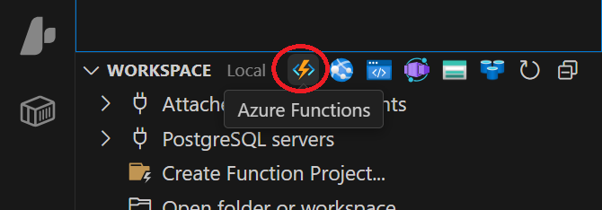
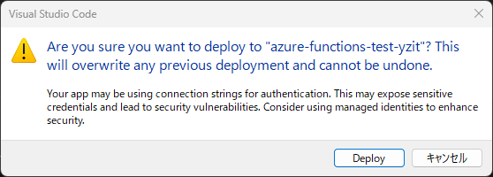

# **Azure Functions を用いたWeb API作成　基礎**

## **1\. はじめに**

この演習では、Microsoft Azureのサーバーレスコンピューティングサービスである Azure Functions を使用して、簡単なWeb APIを作成します。具体的には、HTTP GETリクエストを受け取ると、JSON形式でメッセージを返すPython関数を作成し、Azureにデプロイしてブラウザから動作確認を行います。

### **演習の目的**

* Azure Functions を用いた基本的な開発フローを理解する。  
* VSCode と Azure Functions 拡張機能を使った開発・デプロイ方法を習得する。  
* Python で簡単な HTTP トリガー関数を作成し、JSONレスポンスを返す方法を学ぶ。

### **前提条件**
(PCはWindows11で動作していることを前提とします。)

* 有効なAzureアカウントを持っていること。  
* ローカルマシンにPython (3.8以降推奨) がインストールされ、パスが通っていること。  
* Node.jsがインストールされていて、npmが実行できること
* Visual Studio Code (VSCode) がインストールされていること。  
* VSCode に以下の拡張機能がインストールされていること:  
  * **Azure Resources**: Azureアカウントへのサインインに使用します。  
  * **Azure Functions**: Azure Functionsプロジェクトの作成、管理、デプロイに使用します。  
  * **Python (Microsoft)**: Python開発サポートのため。
* Azure Functions Core Tools がインストールされていること。

Azure Functions Core Toolsがインストールされていない場合、コマンドプロンプトで以下の命令を実行します。
```
npm install -g azure-functions-core-tools --unsafe-perm true
```


## **2\. Azure Functions プロジェクトの作成 (VSCode)**

まず、ローカル環境にAzure Functionsのプロジェクトを作成します。

1. **VSCodeを起動します。**  
2. 左側のアクティビティバーから **Azure アイコン** をクリックし、Azureビューを開きます。  


1. AzureビューのWORKSPACEパネルにある **Functionsアイコン** をクリックし、**Create New Project...**を選択します。  


1. **プロジェクトを保存するフォルダを選択します。**　新規のプロジェクトの場合は、フォルダを作成して選択して下さい。 (例: C:\\Users\\YourUser\\Documents\\AzureFunctionsProjects や \~/AzureFunctionsProjects など)  
2. **プロジェクトの言語として Python を選択します。**  
3. **Pythonインタープリタを選択します。** システムにインストールされているPython環境が表示されるので、適切なものを選択してください。 (仮想環境の使用を推奨しますが、この演習ではグローバル環境でも構いません)  
4. **関数のテンプレートとして HTTP Trigger を選択します。**  
5. **関数名を入力します。** 例: HelloWorldHttpTrigger と入力し、Enterキーを押します。  
6.  **承認レベルを選択します。** Anonymous を選択し、Enterキーを押します。これにより、APIキーなしで誰でもアクセスできるエンドポイントが作成されます（テストが容易になります）。
7.  プロジェクトの開き方を指定します。**Open in current window** で構いませんが、他のオプションを選んでも問題ありません。

これで、指定したフォルダ内にAzure Functionsのプロジェクトファイルと、HelloWorldHttpTrigger という名前の関数が作成されます。

### **3\. 生成されたプロジェクトの確認**

生成されたプロジェクトには、以下のファイルが含まれます。

#### `.gitignore`
このファイルは、Gitが無視すべき意図的に追跡されていないファイルを指定します。

#### `.funcignore`
このファイルは、Azure Functionをデプロイする際に無視すべきファイルとディレクトリを指定します。これにより、不要なファイルがデプロイパッケージに含まれるのを防ぎ、デプロイサイズを最適化し、セキュリティリスクを低減します。

#### `host.json`
このファイルには、ファンクションアプリ内のすべての関数に影響するグローバルな構成オプションが含まれています。ロギング、HTTP設定、その他のランタイム動作を構成するために使用できます。例えば、ロギングレベルの設定、HTTPリクエストのタイムアウト、CORS設定などがこのファイルで定義され、クラウド環境での関数の振る舞いに影響を与えます。ローカルで関数を実行する際にも、Core Toolsはこの`host.json`ファイルを読み込み、クラウド環境と同様の構成で関数を動作させます。これにより、開発者はデプロイ前にクラウド環境での動作を正確にシミュレートできます。

#### `local.settings.json`
このファイルは、ローカル開発環境でのみ使用されるアプリケーション設定、接続文字列、およびその他の環境変数を格納します。クラウドにデプロイされることはありません。このファイルはデプロイパッケージには含まれず、Azure Functionsにデプロイされることはありません。クラウド環境での設定は、Azure Portalのアプリケーション設定やKey Vaultなどで別途管理されます。

#### `requirements.txt`
このファイルは、ファンクションアプリが依存するPythonパッケージをリストアップします。ファンクションアプリがデプロイされると、Azure Functionsはこのファイルを使用して必要なすべての依存関係をインストールします。
#### `function_app.py`
これは、Azure Functionを定義する主要なPythonファイルです。HTTPトリガー関数のロジックが含まれており、リクエストの処理方法とレスポンスの生成方法が記述されています。HTTPリクエストがトリガーされると、このファイル内の対応する関数が呼び出され、そのロジックが実行されます。

```python
import azure.functions as func
import logging

app = func.FunctionApp(http_auth_level=func.AuthLevel.ANONYMOUS)

@app.route(route="HelloWorldHttpTrigger")
def HelloWorldHttpTrigger(req: func.HttpRequest) -> func.HttpResponse:
    logging.info('Python HTTP trigger function processed a request.')

    name = req.params.get('name')
    if not name:
        try:
            req_body = req.get_json()
        except ValueError:
            pass
        else:
            name = req_body.get('name')

    if name:
        return func.HttpResponse(f"Hello, {name}. This HTTP triggered function executed successfully.")
    else:
        return func.HttpResponse(
             "This HTTP triggered function executed successfully. Pass a name in the query string or in the request body for a personalized response.",
             status_code=200
        )

```

一連の動作確認後、求められる仕様に応じてこのコードを書き換えます。


## **4\. ローカルでのテスト実行**

Azureにデプロイする前に、ローカル環境で関数が正しく動作するかテストします。

1. VSCodeで **「実行とデバッグ」** ビューを開きます (左側のアクティビティバーの再生アイコンに虫がついたアイコン)。  
2. デバッグ構成のドロップダウンリストから **「Attach to Python Functions」** (または類似の名称、通常は自動で選択されます) を選択し、緑色の再生ボタン ▶️ をクリックするか、F5キーを押してデバッグを開始します。  
3. VSCodeの **ターミナル** パネルに、ローカルファンクションホストが起動し、関数のエンドポイントURLが表示されます。以下のような形式です:  
```
Functions:
        HelloWorldHttpTrigger:  http://localhost:7071/api/HelloWorldHttpTrigger
For detailed output, run func with --verbose flag.

This HTTP triggered function executed successfully. Pass a name in the query string or in the request body for a personalized response.
```

4. ウェブブラウザを開き、上記ターミナルに表示されたURL (例: http://localhost:7071/api/HelloWorldHttpTrigger) にアクセスします。  
5. ブラウザに以下のようなメッセージが表示されることを確認します:  
```
This HTTP triggered function executed successfully. Pass a name in the query string or in the request body for a personalized response.
```
6. Thunder Client等のAPIテストツールを使い、ボディに以下のような内容を指定してURLにアクセスします。
```
{
  "name": "Taro"
}
```
ステータスコード200で、以下のレスポンスボディが返ることを確認してください。
```
Hello, Taro. This HTTP triggered function executed successfully.
```


7. テスト環境は継続的に動作しており、function_app.pyを編集すると自動的にリロードします。テスト環境を停止するには、タスクマネージャーの詳細で、func.exe を停止してください。

## **5\. Azure Functionsへのデプロイ**

ローカルでの動作確認ができたら、作成した関数をAzureにデプロイします。

### **5.1. Azureへのサインイン (VSCode)**

まだAzureにサインインしていない場合は、VSCodeからサインインします。

1. VSCodeのAzureビューを開き、 ACCOUNTS&TENANTSパネルで、**+** をクリックし、「別のアカウントにサインインする」を選びます。  
2. ブラウザが起動し、Azureの認証画面が表示されるので、指示に従ってサインインします。  
3. サインインが完了すると、VSCodeのステータスバーやAzureパネルにサブスクリプション情報が表示されます。

### **5.2. 関数アプリの作成 (Azure Webコンソール)**

次に、Azureポータルで関数アプリ（関数をホストするためのコンテナ）を作成します。

1. [Azureポータル](https://portal.azure.com/) にアクセスし、サインインします。  
2. 左上の **「＋ リソースの作成」** をクリックします。  
3. 検索ボックスに 関数アプリ と入力し、表示された **「関数アプリ」** を選択して **「作成」** をクリックします。  
4. 　ホスティングオプションページで **「フレックス従量課金」** を選択し、 **「選択」**  をクリックします。これは実行された分だけ課金されることに加え、Linuxを使用する際に推奨されています。  
5. **「関数アプリの作成」** ページで、以下の項目を設定します:  
   * **サブスクリプション**: ご自身のAzureサブスクリプションを選択します。  
   * **リソースグループ**:  
     * **「新規作成」** をクリックし、新しいリソースグループ名を入力します (例: HelloWorldRG)。  
     * または、既存のリソースグループを選択します。  
   * **関数アプリ名**:  
     * **グローバルに一意な名前** を入力します (例: yourname-helloworld-app のように、ご自身の名前や識別子を含めると一意になりやすいです)。この名前がURLの一部になります。  
     * 使用できる文字は英数字とハイフンのみです。  
   * **リージョン**: 関数アプリをデプロイするリージョンを選択します (例: Japan East (東日本))。  
   * **ランタイムスタック**: Python を選択します。  
   * **バージョン**: ローカル開発環境で使用しているPythonのバージョンに近いものを選択します (例: 3.12)。  
   * **インスタンスサイズ**: 使用するメモリサイズを指定します。今回は512MBで十分です。  
6. 上記設定後、**「確認および作成」** ボタンをクリックします。  
7. 設定内容を確認し、問題がなければ **「作成」** ボタンをクリックします。  
   * デプロイが開始されます。完了まで数分かかることがあります。  
   * デプロイが完了すると、「デプロイが完了しました」という通知が表示されます。

### **5.3. VSCode拡張機能を使ったデプロイ**

関数アプリがAzure上に作成されたら、VSCodeからローカルプロジェクトをデプロイします。

1. VSCodeのAzureビューのRESOURCESパネルでFunctionAppを展開し、Azureコンソールで作成した関数アプリを表示します。  
2. 作成した関数アプリを右クリックし、表示されたメニューの **「Deploy to Function App...」**　をクリックします。  
3.  確認ダイアログが表示されたら、 **Deploy** ボタンをクリックします

4.  デプロイが完了すると、「Deployment to "\<関数アプリ名\>" completed.」のようなメッセージが表示されます。

## **6\. Azure上での動作確認**

デプロイが完了したら、Azure上で関数が正しく動作するか確認します。

1. **Azureポータルで関数URLを取得します。**  
   * Azureポータルで、デプロイした関数アプリ (例: yourname-helloworld-app) を開きます。  
   * **「概要」** ページの **「関数」**  セクションで、関数の一覧に HelloWorldHttpTrigger が表示されていることを確認し、クリックします。  
   * 関数の概要ページが表示されたら、上部にある **「関数の URL の取得」** をクリックします。  
   * 表示されたURLをコピーします。URLは以下のような形式です:  
     https://\<関数アプリ名\>.azurewebsites.net/api/HelloWorldHttpTrigger  
     (承認レベルを Anonymous に設定したため、?code=... のようなAPIキーは通常不要です。)  
2. **ブラウザでテストします。**  
   * コピーしたURLをウェブブラウザのアドレスバーに貼り付けてアクセスします。  
   * ブラウザに以下のような　文字列が表示されることを確認します。
```
This HTTP triggered function executed successfully. Pass a name in the query string or in the request body for a personalized response.
```  
3. **Thunder Client等のAPIテストツールを用いてテストします。** 
ボディに以下のような内容を指定してURLにアクセスします。
```
{
  "name": "Taro"
}
```
ステータスコード200で、以下のレスポンスボディが返ることを確認してください。
```
Hello, Taro. This HTTP triggered function executed successfully.
```

## **7\. まとめ**

この演習では、以下の手順を通してAzure Functionsを用いた簡単なWeb API開発を体験しました。

* VSCodeでAzure Functions (Python) プロジェクトを作成  
* ローカル環境で関数をテスト実行  
* Azureポータルで関数アプリを作成  
* VSCodeからAzureへ関数をデプロイ  
* Azure上でデプロイされた関数をブラウザからテスト

Azure Functionsのようなサーバーレスアーキテクチャを利用することで、インフラの管理を気にすることなく、コードの実行に集中できます。また、実行回数に応じた従量課金制のため、コスト効率にも優れています。

### **不必要な課金を防ぐためAzure上にデプロイされた関数アプリは、必要な時以外Azureポータルの関数アプリ画面で停止するようにしてください。** 


## **8\. (オプション) トラブルシューティング**

* **Pythonのバージョン不一致**: ローカルで使用しているPythonのバージョンと、Azure Function Appで設定したPythonのバージョンが大きく異なると問題が発生することがあります。できるだけバージョンを合わせてください。  
* **デプロイエラー**: VSCodeの出力ウィンドウ（Azure Functionsチャネル）に表示されるエラーメッセージを確認してください。依存関係の問題や設定ミスが原因であることが多いです。  
* **ファイアウォール/プロキシ**: 企業内ネットワークなど、プロキシ設定が必要な環境では、VSCodeやAzure Functions Core Toolsが外部にアクセスできない場合があります。ネットワーク管理者に確認してください。  
* **local.settings.json**: このファイルはローカル設定用で、通常 .gitignore に含まれておりAzureにはデプロイされません。Azure上でのアプリケーション設定は、Azureポータルの関数アプリの「構成」メニューから行います。今回の演習では Anonymous 認証のため特別な設定は不要です。

