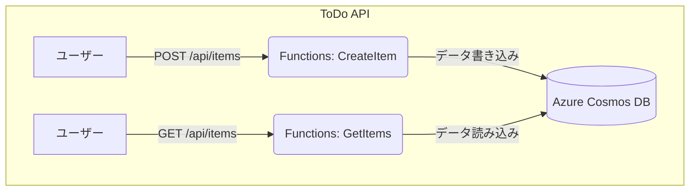

# **Azure Functions を用いたWeb API作成　CosmosDBとの連携**

## **1. はじめに**
重要：このチュートリアルは、[Azure Functions を用いたWeb API作成　基礎(./azure-functions-http-basic-python.md)](./azure-functions-http-basic-python.md) の内容を理解していることを前提にしています。

このハンズオンでは、最新のv2プログラミングモデルを使用し、Azure FunctionsとAzure Cosmos DBを連携させる方法を学びます。具体的には、**Pythonデコレーター（アノテーション）** を使って、ToDo項目を**登録する関数（POST）**と、**一覧を取得する関数（GET）**を直感的に実装します。

### **学習目標**

* ToDo APIのバックエンドとして必要なAzureリソース（Cosmos DB, Functions）を作成できる。  
* VS Codeの拡張機能を使い、**v2モデルのAzure Functionsプロジェクト**を作成できる。  
* **Pythonデコレーター**を使い、**出力バインディング**と**入力バインディング**をコード内で直接定義できる。  
* PythonでAPIのロジックを記述し、**ローカルでテスト**した後にAzureへデプロイできる。

### **今回作成するシステムの構成**

## **2. 事前準備**

このハンズオンを開始する前に、以下の準備が完了していることを確認してください。

* 有効なサブスクリプションを持つAzureアカウント  
* Visual Studio Code  
* Python 3.9 以降（v2モデルで推奨）  
* **VS CodeにAzure Functions拡張機能がインストールされていること**  
* VS Codeに **Thunder Client** 拡張機能がインストールされているか、**Postman** などのAPIテストツールが利用できること

## **3. Azure Cosmos DB リソースの作成**

最初に、ToDo項目の保存先となるAzure Cosmos DBを準備します。

1. **Azure Portalにサインイン**します。  
2. 「リソースの作成」からAzure Cosmos DBを検索し、作成します。  
3. APIとして「**Azure Cosmos DB for NoSQL**」を選択します。  
4. **アカウント作成画面**で以下の情報を入力します。  
   * **アカウント名**: 世界中で一意の名前（例: todo-api-cosmos-あなたの名前）  
   * **場所**: (Asia Pacific) Japan East （東日本）などを選択。（もし選択できない場合は、Korea Central や Southeast Asia など別のリージョンを選択）  
   * **ワークロードの種類を選択**: 「**開発**」を選択。  
   * **容量モード**: 「**サーバーレス**」を選択。  
5. 作成後、リソースに移動し「**データエクスプローラー**」を開きます。  
6. 「**新しいコンテナー**」をクリックし、以下を設定します。  
   * **データベースID**: ToDoList  
   * **コンテナーID**: Items  
   * **パーティションキー**: /id  
7. 「OK」をクリックします。  
8. **接続文字列の取得**:  
   * 作成したCosmos DBアカウントのページで、左メニューの「キー」を選択します。  
   * 「**プライマリ接続文字列**」の値をコピーし、メモ帳などに控えておきます。この後の手順で使います。

## **4. Azure Functions プロジェクトの作成と設定**

次に、ToDo APIのベースとなるAzure Functionsプロジェクトを作成し、Cosmos DBへの接続情報を設定します。

### **4.1. VS Codeでv2モデルのプロジェクトを作成する**

1. PCの任意の場所に todo-api-v2 という名前で空のフォルダを作成し、そのフォルダをVS Codeで開きます。  
2. VS Codeのメニューで「表示」>「**コマンドパレット**」を選択します。（ショートカットキー: Ctrl+Shift+P または Cmd+Shift+P）  
3. コマンドパレットに Azure Functions と入力し、表示された一覧から「**Azure Functions: 新しいプロジェクトの作成...**」（Create New Project...）を選択します。  
4. プロンプト（画面上部に表示される質問）に順番に答えていきます。  
   * Select a folder...: **1で開いたtodo-api-v2フォルダ**を選択します。  
   * Select a language: **Python** を選択します。  
   * Select a programming model: 「**Model V2**」を選択します。（**これが最も重要です**）  
   * Select a Python interpreter...: ご自身のPCにインストールされているPython 3.9以降のバージョンを選択します。  
   * Select a template for your first function: 「**HTTP Trigger**」を選択します。  
   * Provide a function name: 「**http_trigger**」のままでEnterキーを押します。（後でコード全体を置き換えるため、名前は問いません）  
   * Select setting for authorization level: 「**Anonymous**」を選択します。  
5. プロジェクトの作成が完了すると、VS Codeのエクスプローラーにfunction\_app.pyというファイルを含むプロジェクト一式が自動で生成されます。v2モデルでは、このファイルにすべての関数を記述していきます。

### **4.2. プロジェクトにCosmos DBの接続情報を設定する**

1. エクスプローラーから local.settings.json ファイルを開きます。  
2. "Values" の中に、"CosmosDbConnectionString" というキーを追加し、**手順3.8でコピーしておいたCosmos DBのプライマリ接続文字列**を値として貼り付けます。  
```json
   {  
     "IsEncrypted": false,  
     "Values": {  
       "AzureWebJobsStorage": "",  
       "FUNCTIONS_WORKER_RUNTIME": "python",  
       "CosmosDbConnectionString": "AccountEndpoint=https://..."  
     }  
   }
```
## **5. ToDo APIの実装 (function_app.py)**

プロジェクトのメインファイルである function_app.py を編集し、ToDoの登録(POST)と取得(GET)の2つのAPIを実装します。2つのAPIはどちらもCosmosDBにアクセスします。そのため、Azure Functions の機能であるバインディングを使用します。

### バインディング (Bindings)
Azure Functionsにおける「バインディング」は、関数と他のAzureサービス（データベース、ストレージ、メッセージキューなど）との接続を簡素化するための強力な機能です。これにより、開発者は外部サービスとの統合ロジックを自分で書くことなく、データの入出力を行うことができます。

バインディングには主に以下の3種類があります。

*   **トリガー (Trigger)**: 関数を実行するイベントを定義します。HTTPリクエスト、タイマー、データベースの変更、メッセージキューへのメッセージ追加など、様々なイベントをトリガーとして設定できます。今回の演習ではHTTPトリガーを使用しています。
*   **入力バインディング (Input Binding)**: 関数が外部サービスからデータを読み込む方法を定義します。例えば、HTTPリクエストからデータを取得したり、Cosmos DBのドキュメントを読み込んだり、Blob Storageからファイルを読み込んだりすることができます。
*   **出力バインディング (Output Binding)**: 関数が処理結果を外部サービスに書き込む方法を定義します。例えば、HTTPレスポンスを返したり、Cosmos DBにドキュメントを書き込んだり、メッセージキューにメッセージを送信したりすることができます。

バインディングは、`function_app.py`内のデコレータ（例: `@app.route`, `@app.blob_output`など）や、`function.json`ファイル（他の言語や一部のPythonシナリオで使用）で定義されます。これにより、関数コードは外部サービスとのやり取りの詳細から解放され、ビジネスロジックに集中できるようになります。

### コーディング

1. VS Codeのエクスプローラーで function_app.py を開きます。  
2. 既存のサンプルコードを**すべて削除**し、以下のコードに置き換えます。  
```python
   import azure.functions as func  
   import logging  
   import json  
   import uuid

   # Function Appのインスタンスを作成します。  
   # http_auth_level=func.AuthLevel.ANONYMOUS は、APIキーなしでアクセスできることを意味します。  
   app = func.FunctionApp(http_auth_level=func.AuthLevel.ANONYMOUS)

   # ToDo項目を登録する関数 (POST /api/items)  
   @app.route(route="items", methods=\["POST"\])  
   @app.cosmos_db_output(arg_name="newItem",  
                           database_name="ToDoList",  
                           container_name="Items",  
                           connection="CosmosDbConnectionString")  
   def create_item(req: func.HttpRequest, newItem: func.Out[func.Document]) -> func.HttpResponse:
       logging.info('Python HTTP trigger function processed a request to create an item.')

       try:  
           req_body = req.get_json()  
       except ValueError:  
           return func.HttpResponse("Request Body is not a valid JSON.", status_code=400)

       name = req_body.get('name')  
       if not name:  
           return func.HttpResponse("Please pass a 'name' in the request body.", status_code=400)

       try:  
           # Cosmos DBのパーティションキー/idとしてユニークなIDを追加  
           req_body['id'] = str(uuid.uuid4())

           # 受け取ったJSONデータをCosmos DBドキュメントとしてセット  
           newItem.set(func.Document.from_dict(req_body))

           # レスポンスにはIDを含んだデータを返す  
           return func.HttpResponse(  
               body=json.dumps({'message': 'Item created successfully.', 'data': req_body}),  
               status_code=201,  
               mimetype="application/json"  
           )  
       except Exception as e:  
           logging.error(f"Error: {e}")  
           return func.HttpResponse("Error creating item.", status_code=500)

   # ToDo項目を一覧取得する関数 (GET /api/items)  
   @app.route(route="items", methods=\["GET"\])  
   @app.cosmos_db_input(arg_name="items",  
                          database_name="ToDoList",  
                          container_name="Items",  
                          connection="CosmosDbConnectionString",  
                          sql_query="SELECT * from c")  
   def get_items(req: func.HttpRequest, items: func.DocumentList) -> func.HttpResponse:  
       logging.info('Python HTTP trigger function processed a request to get items.')

       if not items:  
           return func.HttpResponse("[]", status_code=200, mimetype="application/json")

       # Cosmos DBから取得したドキュメントを辞書のリストに変換  
       items_dict = [item.to_dict() for item in items]

       return func.HttpResponse(  
           body=json.dumps(items_dict),  
           status_code=200,  
           mimetype="application/json"  
       )
```
   **【解説】**  
   * @app.route(): 関数のトリガーとなるHTTPエンドポイントを定義します。route="items"は、/api/itemsというURLに対応します。methodsで許可するHTTPメソッドを指定します。  
   * @app.cosmos_db_output(): **出力バインディング**を定義します。関数が返すデータをCosmos DBに書き込むよう設定しています。  
   * @app.cosmos_db_input(): **入力バインディング**を定義します。sql_queryで指定したクエリの結果が、関数の引数(items)に自動的に渡されます。

## **6\. ローカル環境でのテスト**

Azureにデプロイする前に、自分のPC上で関数が正しく動作するかを確認します。

1. **ローカルホストの開始**  
   * VS Codeのメニューから「ターミナル」>「新しいターミナル」を選択します。  
   * 開いたターミナルで、以下のコマンドを実行してローカルのFunctionsホストを開始します。  
     func start

   * ターミナルに、起動した関数のURL（例: http://localhost:7071/api/items）が表示されるのを確認します。  
2. **APIのテスト**  
   * **Thunder Client** や **Postman** などのAPIテストツールを使ってテストを行います。

   * #### **POSTリクエストでデータを登録する**      **2〜3回、内容を変えて実行し、データを複数件登録しておきましょう。**

     * **メソッド**: POST  
     * **URL**: http://localhost:7071/api/items  
     * **Headers**: Content-Type を application/json に設定します。  
     * **Body**: JSON を選択し、以下の内容を貼り付けます。  
      ```json
       {  
           "name": "牛乳を買う",  
           "description": "ローカルから登録",  
           "completed": false  
       }
      ```
     * リクエストを送信し、201 Created というステータスコードとメッセージが返ってくることを確認します。レスポンスのBodyにidが追加されていることも確認しましょう。

   * #### **GETリクエストでデータ一覧を取得する**

     * **メソッド**: GET  
     * **URL**: http://localhost:7071/api/items  
     * リクエストを送信し、レスポンスのBodyに登録したデータの一覧がJSON形式で表示されることを確認します。  
   * **Azure Portal**のCosmos DBのデータエクスプローラーでも、データがリアルタイムに保存されていることを確認できます。  
3. **ローカルホストの停止**  
   * テストが終わったら、func startを実行しているターミナルを選択し、Ctrl+Cを押してホストを停止します。

## **7. Azureへのデプロイとテスト**

ローカルでの動作確認が完了したら、APIをAzureにデプロイします。
   ( デプロイ先となるAzure Functions アプリケーションがない場合は作成してください。)

1. **VS CodeからAzureへデプロイ**  
   * VS CodeのアクティビティバーからAzureアイコンを選択します。  
   * RESOURCESビューでデプロイする対象のアプリケーションを表示し、右クリックします。
   * コンテキストメニューから、「Deploy to Function App...」 を選択します。

2. **デプロイした関数アプリに接続文字列を設定する**  
   * Azure Portalでデプロイした関数アプリのページを開き、左側メニューの「設定」セクションから「**環境変数**」を選択します。  
   * 「アプリケーション設定」タブが表示されていることを確認し、「**+ 追加**」をクリックします。  
   * **名前**の欄に CosmosDbConnectionString、**値**の欄に（手順3.8でコピーしたCosmos DBのプライマリ接続文字列）を入力し、「OK」と「保存」をクリックして変更を適用します。  
3. **デプロイしたAPIのテスト**  
   * Azure Portalでデプロイした関数アプリのページを開き、「関数」からcreate_itemまたはget_itemsを選択し、「関数のURLの取得」でベースURLを取得します。エンドポイントは /api/items です。  
   * ローカルテストと同様にAPIテストツールを使って、今度はURLを**デプロイ先のURL**に変更してPOSTとGETのリクエストを送信し、動作を確認してください。

## **8. まとめ**

このハンズオンでは、最新のv2プログラミングモデルを使い、Pythonデコレーターで直感的にバインディングを定義することで、Cosmos DBと連携する本格的なToDo APIを効率的に構築しました。また、Azureへデプロイする前にローカル環境でテストを行う、基本的な開発サイクルも体験できました。
