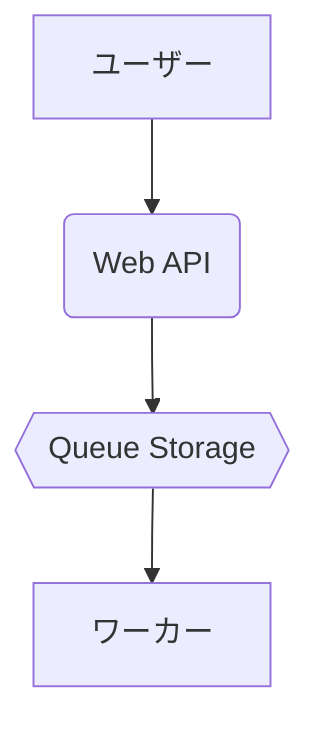
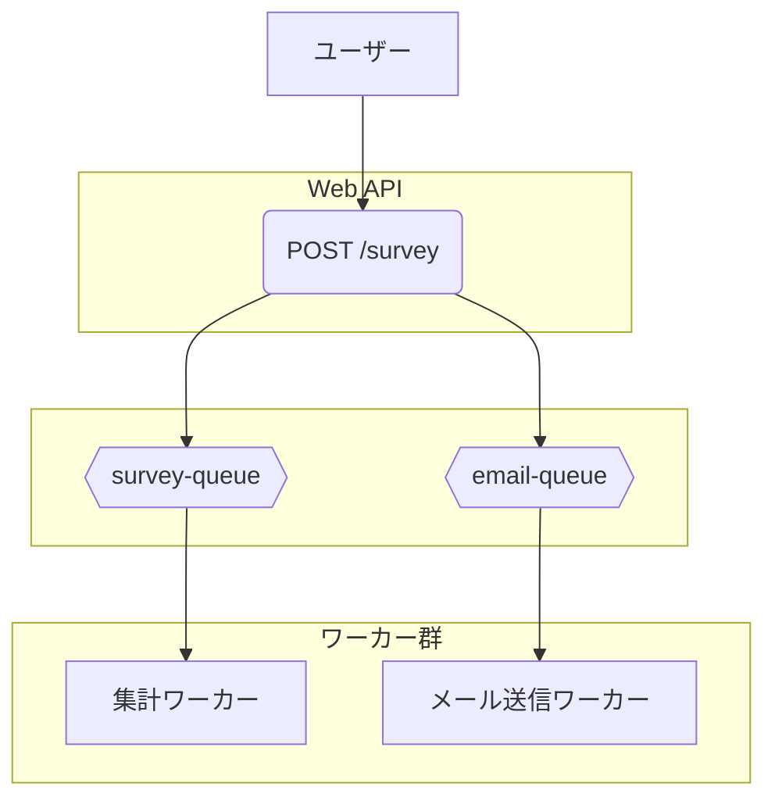

# **Azure Queue Storage 基礎 ～ 非同期処理で実現する、応答性が高く堅牢なWebシステム構築 ～**

## **1. はじめに**

### **本ハンズオンの目的**

本ハンズオンでは、Azure Queue Storage を利用して、応答性が高いWebシステムを構築する基本的な手法を学習する。

* **【本演習のゴール】:** 非同期処理の基本を実装し、キューの必要性を理解する。

### **キューの必要性 - なぜ「順番待ち」の仕組みが重要なのか？**

Webシステムを開発していると、完了までに時間がかかる「重い処理」に直面することがあります。例えば、以下のような処理です。

* **動画の変換:** ユーザーがアップロードした動画を、スマートフォン用やPC用など複数の形式に変換する。  
* **レポートの生成:** 大量のデータから分析レポートを作成する。  
* **メールの大量送信:** 何千人ものユーザーに一斉にメールマガジンを送信する。  
* **ECサイトの注文処理:** 支払い、在庫の更新、注文確認メールの送信、配送システムへの連携など、複数の処理を一度に行う。

これらの処理を、ユーザーからのリクエストに応じてその場で実行する方式を**同期処理**と呼びます。しかし、同期処理には大きな問題があります。

#### **問題点：同期処理の限界（レストランの例）**

人気のレストランで、一人の店員が「注文受付」「調理」「配膳」「会計」の全てを担当している状況を想像してください。

1. Aさんが注文すると、店員はAさんの料理が完成し、会計が終わるまで他の誰の対応もできません。  
2. その間、BさんやCさんは入り口でただひたすら待ち続けることになります。

これが同期処理のイメージです。Webシステムでは、ユーザーの画面がフリーズし、ユーザーは処理が終わるまで何もできずに待たされることになります。これではユーザー体験（UX）は非常に悪くなります。

#### **解決策：非同期処理とキューの活用**

この問題を解決するのが、**非同期処理**と**キュー**です。先ほどのレストランの例えを、役割分担を導入して改善してみましょう。

1. 受付係（**Web API**）は、来店したお客様の注文を次々と受け付け、整理券（**メッセージ**）を渡して席にご案内します。お客様はすぐに「注文は受け付けられた」と安心できます。  
2. 受付係は、受け付けた注文票を「順番待ちの列（**キュー**）」に置きます。  
3. 厨房のシェフ（**ワーカー**）は、自分のペースでキューから注文票を1枚ずつ取り出し、調理に専念します。

このように、**すぐに終わる処理（受付）**と**時間のかかる処理（調理）**を分離し、その間に「キュー」を挟むことで、システム全体がスムーズに流れるようになります。ユーザー（お客様）を待たせることなく、システムは裏側で効率的に重い処理を実行できるのです。

#### **キューのメッセージを処理する様々な方法**

キューに届いたメッセージ（タスク）を処理する「ワーカー」の実装方法は、主に2つのアプローチがあります。

1. **イベント駆動型（サーバーレス） - Azure Functions**  
   * **特徴:** キューに新しいメッセージが追加されたことを**きっかけ（イベント）**として、自動的にプログラムが実行されます。  
   * **利点:** メッセージがない時はプログラムが待機しているため、コストを非常に低く抑えられます。サーバーの管理が不要で、メッセージの量に応じて自動で処理能力を調整（スケール）してくれます。多くのモダンなシステムで採用されている効率的な方法です。  
2. **常時実行型 - Azure App Service (WebJobs) や仮想マシン**  
   * **特徴:** ワーカーとなるプログラムを常に起動しておき、プログラム自身が定期的に「新しいメッセージはありますか？」とキューを確認（ポーリング）しにいきます。  
   * **利点:** プロセスの挙動を細かく制御したい場合や、常に稼働し続ける必要がある複雑な処理に適しています。  
   * **本ハンズオンでのアプローチ:** 今回の演習では、この常時実行型の考え方をローカルPC上のコンソールアプリで再現します。これにより、キューとワーカーが連携する基本的な仕組みを直接的に理解することができます。

本ハンズオンでは、常時実行型のプログラムがキューを監視してメッセージを処理するシステムを構築し、この非同期処理を実現する中核技術として **Azure Queue Storage** を活用します。

### **準備**

* Azure サブスクリプション  
* Visual Studio Code  
* Node.js (LTS版)  
* Postman、curl等のAPIリクエストツール

## **2. ハンズオン演習 - 非同期処理による応答性向上の基本 (60分)**

この演習では、シンプルな「Webアンケート受付システム」を構築します。このシステムは、2つの主要なコンポーネントで構成されています。

1. **Web API（受付役）:** ユーザーからのアンケート投稿を受け付け、その内容をすぐにキューに送信します。そして、重い処理を待たずに即座に「受け付けました」という応答をユーザーに返します。  
2. **コンソールワーカー（集計役）:** バックグラウンドで常にキューを監視しています。キューに新しいアンケートデータが追加されると、それを取り出して、データベースへの保存や集計といった（今回はシミュレーションとしての）時間のかかる処理を実行します。

この演習を通して、APIとワーカーがキューを介してどのように連携し、ユーザー体験を向上させるかを具体的に学びます。

**目標:** Web APIとバックグラウンド処理をキューで分離（デカップリング）する基本構成を実装し、その効果を理解する。

**シナリオ:** ユーザーからのアンケート投稿を受け付け、時間のかかる集計処理をバックグラウンドで実行し、ユーザーには即座に完了応答を返す「Webアンケート受付システム」を構築する。

### **ステップ1: Azureリソースの準備 (10分)**

1. **Azure Portal** にサインインする。  
2. **リソースグループ**を新規作成します。名前は queue-practice とします。  
3. リソースグループ内に**ストレージアカウント**を新規作成する。  
   * **「基本」タブ:**  
     * **ストレージアカウント名:** queuestorage[受講者名や学籍番号など] のように、世界で一意になる名前を付けます。（例: queuestorageyamada）  
     * **パフォーマンス:** Standard  
     * **冗長性:** LRS (ローカル冗長ストレージ) を選択します。  
   * **その他のタブ:** 「詳細設定」や「ネットワーク」などのタブは、この演習ではデフォルト設定のままで問題ありません。  
   * **確認と作成:** 画面下部の「確認」または「確認および作成」ボタンをクリックし、内容に問題がなければ最後に「作成」をクリックしてデプロイを開始します。  
4. デプロイ完了後、作成したストレージアカウントのメニューから「キュー」を選択し、新しいキューを作成する。  
   * **キュー名:** survey-queue  
5. ストレージアカウントのメニューから「アクセスキー」を選択し、**接続文字列 (Connection String)** をコピーする。これはプログラムからAzure Storageに接続するために使用される。

### **ステップ2: Web API (受付役) の実装 (20分)**

ユーザーからのリクエストを受け取り、キューにメッセージを追加するAPIを実装する。

1. ローカルPCに作業用フォルダ（例: azure-handson）を作成し、その中に web-api フォルダを作成する。  
2. VS Codeで web-api フォルダを開き、ターミナルで以下のコマンドを実行して必要なパッケージをインストールする。  
   ```
   npm init -y  
   npm install express @azure/storage-queue
   ```
3. index.js ファイルを作成し、以下のコードを記述する。  
   ```
   // index.js (Web API)  
   const express = require('express');  
   const { QueueClient } = require("@azure/storage-queue");

   const app = express();  
   app.use(express.json());

   // 使用するAzure Storageの接続文字列に置換  
   const CONNECTION_STRING = "ここにAzure Storageの接続文字列を貼り付け";  
   const QUEUE_NAME = "survey-queue";

   app.post('/survey', async (req, res) => {  
       try {  
           console.log('アンケートリクエスト受信:', req.body);

           // 1. QueueClientのインスタンスを作成  
           const queueClient = new QueueClient(CONNECTION_STRING, QUEUE_NAME);

           // 2. キューが存在しない場合は作成  
           await queueClient.createIfNotExists();

           // 3. リクエストボディをJSON文字列に変換し、Base64エンコード  
           const messageText = JSON.stringify(req.body);  
           const base64Message = Buffer.from(messageText).toString('base64');

           // 4. キューにメッセージを送信  
           await queueClient.sendMessage(base64Message);  
           console.log(`メッセージをキューに追加: ${messageText}`);

           // 5. ユーザーに受付完了の応答を返す  
           res.status(202).send({ message: "アンケートの集計処理を受け付けました。" });

       } catch (error) {  
           console.error(error);  
           res.status(500).send({ message: "サーバーエラーが発生しました。" });  
       }  
   });

   const port = 3000;  
   app.listen(port, () => {  
       console.log(`Web APIサーバー起動 (ポート: ${port})`);  
   });
   ```
4. CONNECTION_STRING の値を、ステップ1でコピーした自身の接続文字列に置換する。

### **ステップ3: コンソールワーカー (集計役) の実装 (20分)**

キューを監視し、メッセージが存在すれば取り出して処理するワーカープロセスを実装する。

1. azure-handson フォルダ内に worker フォルダを新規作成する。  
2. VS Codeで worker フォルダを開き、ターミナルで以下のコマンドを実行する。  
   ```
   npm init -y  
   npm install @azure/storage-queue
   ```
3. index.js ファイルを作成し、以下のコードを記述する。  
   ```
   // index.js (Worker)  
   const { QueueClient } = require("@azure/storage-queue");

   // 使用するAzure Storageの接続文字列に置換  
   const CONNECTION_STRING = "ここにAzure Storageの接続文字列を貼り付け";  
   const QUEUE_NAME = "survey-queue";

   async function main() {  
       console.log("ワーカー起動。キューの監視を開始します。");  
       const queueClient = new QueueClient(CONNECTION_STRING, QUEUE_NAME);

       // 無限ループでキューをポーリング  
       while (true) {  
           try {  
               // 1. キューからメッセージを最大1件受信 (30秒間、他のプロセスから不可視化)  
               const response = await queueClient.receiveMessages({  
                   numberOfMessages: 1,  
                   visibilityTimeout: 30   
               });

               if (response.receivedMessageItems.length > 0) {  
                   const message = response.receivedMessageItems[0];

                   // 2. Base64デコードして元のJSON文字列に復元  
                   const messageText = Buffer.from(message.messageText, 'base64').toString();  
                   console.log(`[処理開始] メッセージ受信:`, messageText);

                   // 3. 時間のかかる集計処理のシミュレーション  
                   await new Promise(resolve => setTimeout(resolve, 3000)); // 3秒待機

                   // 4. 処理完了後、キューからメッセージを削除  
                   await queueClient.deleteMessage(message.messageId, message.popReceipt);  
                   console.log(`[処理完了] メッセージを削除しました。`);  
               } else {  
                   // キューが空の場合、5秒待機  
                   await new Promise(resolve => setTimeout(resolve, 5000));  
               }  
           } catch (error) {  
               console.error("エラー発生:", error);  
               // エラー発生時も5秒待機してリトライ  
               await new Promise(resolve => setTimeout(resolve, 5000));  
           }  
       }  
   }

   main();
   ```
4. CONNECTION_STRING の値を、自身の接続文字列に置換する。

### **ステップ4: 動作確認 (10分)**

1. **ワーカーの起動:** worker フォルダのターミナルで node index.js を実行する。  
2. **Web APIの起動:** web-api フォルダのターミナルで node index.js を実行する。  
3. **リクエストの送信:** Postman等のツールを使用し、以下の設定でWeb APIにリクエストを送信する。**後の演習課題で使用するため、この段階でemailフィールドを含めておきます。**  
   * **Method:** POST  
   * **URL:** http://localhost:3000/survey  
   * **Body (raw, JSON):**  
    ```
     {  
         "user": "Taro Yamada",  
         "rating": 5,  
         "comment": "Good",  
         "email": "taro@example.com"  
     }
    ```
4. **結果の確認:**  
   * **APIクライアント:** リクエストを送信すると、Postmanには**即座に**「アンケートの集計処理を受け付けました。」という応答が返されることを確認する。  
   * **Azure Portalでの確認 (ここが重要):**  
     1. リクエスト送信後、すぐにAzure Portalを開き、ストレージアカウントの survey-queue を表示します。  
     2. 画面上部にある「更新」ボタンをクリックすると、キュー内のメッセージが一覧で表示されます。ID、メッセージテキスト、挿入時刻、デキュー数などの列があることを確認してください。  
     3. 一覧に新しいメッセージが1件追加され、メッセージテキストに送信したJSONデータが表示されていることを確認します。これが、Web APIがメッセージをキューに追加した証拠です。  
     4. そのまま数秒待ってから再度「更新」ボタンをクリックすると、一覧からメッセージが消えていることを確認します。これは、バックグラウンドで起動しているワーカーがメッセージを取得・処理し、キューから削除したことを意味します。  
   * **ワーカーのログ:** ワーカーを実行しているターミナルに、リクエストから**少し遅れて**「[処理開始]...」「[処理完了]...」というログが出力されることを確認する。

この一連の動作を確認することで、Web APIがキューにタスクを預け、ワーカーがそれを非同期に処理している流れを視覚的に追跡できます。

## **3. 演習課題：1つのイベントから複数の処理を実行する**

ここまでの演習では、1つのアンケート投稿に対して「集計」という1つの処理だけを実行しました。しかし実際のシステムでは、1つの出来事をきっかけに、複数の異なる処理を並行して実行したいケースが頻繁にあります。

この課題では、**「ファンアウト（Fan-out）」パターンを実装し、「1つのアンケート投稿」というイベントから、「集計処理」と「メール送信処理」の両方を**実行するシステムに拡張します。

### **課題のシナリオ**

現在のシステムに、アンケート投稿者に対してサンキューメールを送る機能を追加します。重要なのは、**集計処理とメール送信処理が、それぞれ独立して確実に実行される**ことです。

### **実装のポイント：ファンアウトパターン**

このパターンでは、タスクの種類ごとに専用のキューを用意します。

1. **複数のキューを用意する:** 「集計用」と「メール送信用」の2つのキューが必要です。  
2. **APIは全てのキューにメッセージを入れる:** Web APIはリクエストを受け取ると、**両方のキューに**同じ内容のメッセージを送信します。  
3. **各ワーカーは専用のキューを監視する:**  
   * 集計ワーカーは「集計用キュー」だけを監視します。  
   * メール送信ワーカーは「メール送信用キュー」だけを監視します。

こうすることで、1つのイベントから派生した複数のタスクが、互いに影響を与えることなく並行して処理されます。

解答は[こちら](./azure-queue-storage-basics-ans.md)です。

## **4. まとめ**

本ハンズオンでは、以下の項目について学習した。

* **応答性の向上:** キューを用いた処理の非同期化によるユーザーエクスペリエンスの改善。  
* **システムの分離（デカップリング）:** APIとワーカーを分離することによる、開発・運用・スケールにおける独立性の確保。

これらの技術要素は、現代的なWebシステム開発において重要な概念である。