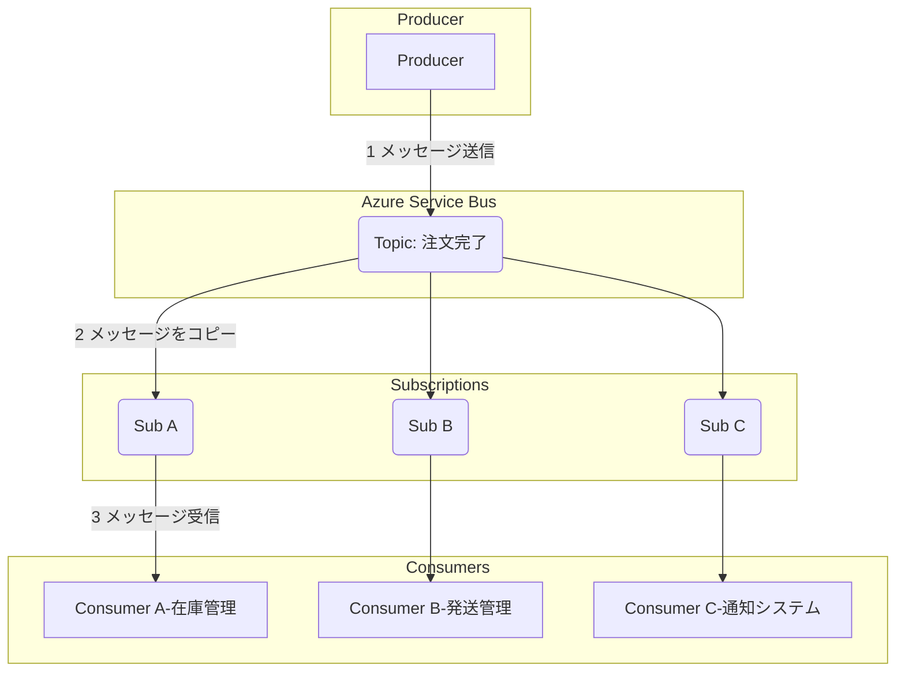
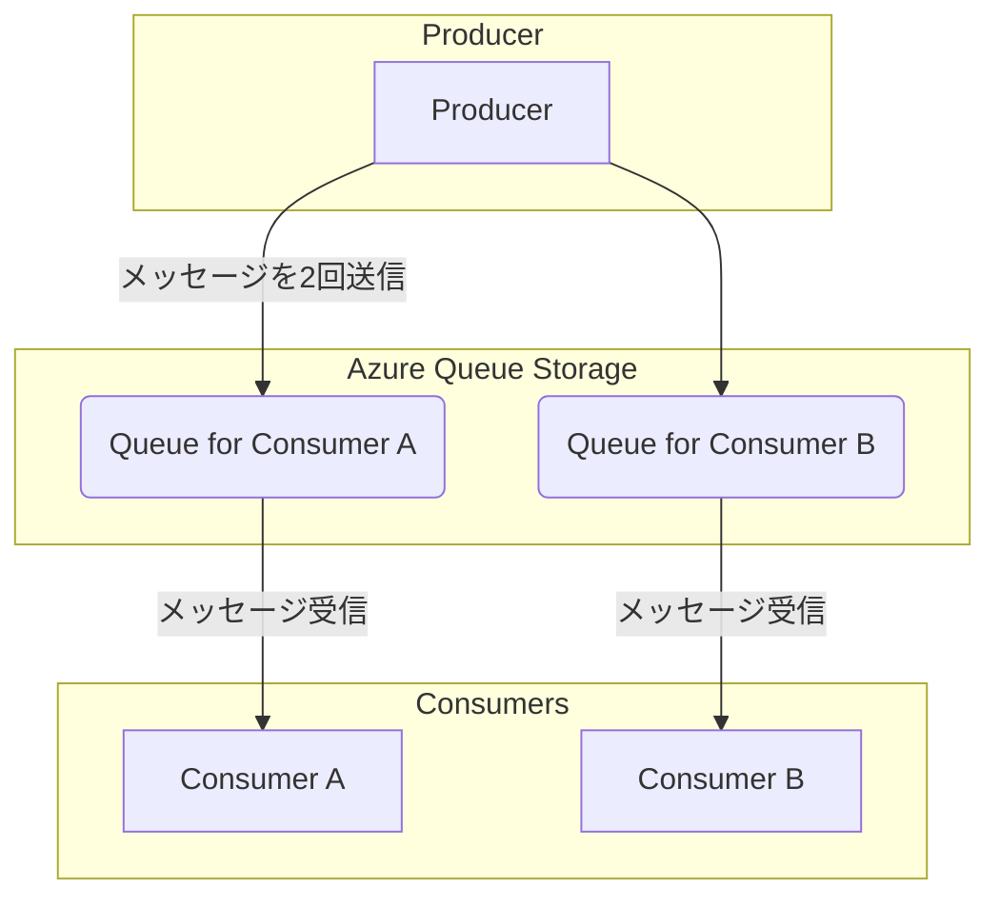
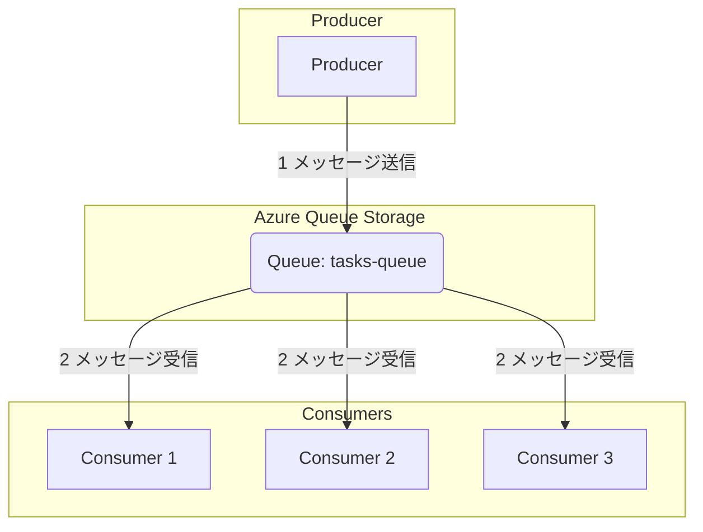
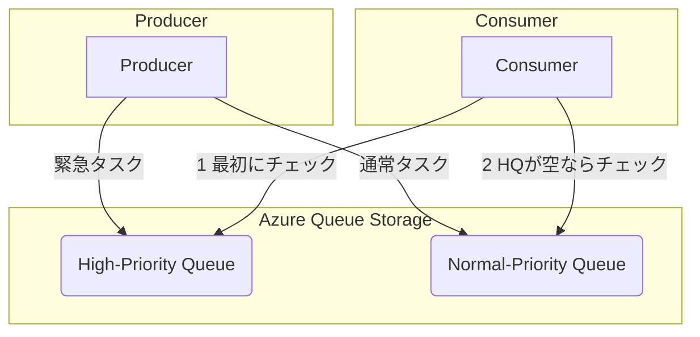

# **Azure Queue Storage によるメッセージングパターン実践1**

## **1. 概要**

本ハンズオンは、「Azure Queue Storage の基本」の応用編です。実際のシステム開発で重要となる以下のメッセージングパターンについて、Python と Azure Queue Storage を用いて実践的に学習します。

* **ファンアウト (Fan-out) パターン**: 1つのメッセージを複数のコンシューマーに配信するパターン  
* **競合コンシューマー (Competing Consumers) パターン**: 処理能力を向上させ、システムをスケールさせるためのパターン  
* **優先度付きキュー (Priority Queue) パターン**: 緊急性の高いタスクを先に処理するためのパターン

これらのパターンを理解することで、より柔軟でスケーラブルなアプリケーションの構築が可能になります。

### **学習目標**

* ファンアウトパターンの概念とAzureでの実現方法を理解する。  
* 競合コンシューマーパターンの仕組みを理解し、実装できる。  
* 優先度付きキューパターンの実現方法を理解し、実装できる。

### **前提条件**

* Python 3.8 以降  
* Azure Storage アカウントと接続文字列

本ハンズオンでは、プロジェクトごとに独立したPython環境を構築するため、仮想環境の使用を推奨します。

1. プロジェクトディレクトリの作成  
まず、このハンズオン用のディレクトリを作成して移動します。ここでは例として queue-pattern-azure という名前にします。  
```
mkdir queue-pattern-azure  
cd queue-pattern-azure
```

2. 仮想環境の作成  
プロジェクト用のディレクトリで、以下のコマンドを実行して venv という名前の仮想環境を作成します。 
``` 
python -m venv venv
```
3. 仮想環境のアクティベート  
作成した仮想環境をアクティベート（有効化）します。

* **Windows (コマンドプロンプト / PowerShell):** 
  ``` 
  venv\Scripts\activate
  ```
* **macOS / Linux (bash/zsh):**
  ```  
  source venv/bin/activate
  ```
アクティベートされると、コマンドプロンプトの先頭に (venv) と表示されます。

1. 必要なライブラリのインストール  
アクティベートした仮想環境で、以下のコマンドを実行して必要なライブラリをインストールします。  
```
pip install azure-storage-queue python-dotenv
```
1. 接続文字列の設定 (.envファイル)  
プロジェクトのルートディレクトリ（queue-pattern-azure）に .env という名前のファイルを作成し、以下の内容を記述します。これにより、接続文字列を安全にコードから分離できます。 
``` 
# .env  
AZURE_STORAGE_CONNECTION_STRING="<YOUR_CONNECTION_STRING>"
```
**注意:** <YOUR_CONNECTION_STRING> の部分を、ご自身のAzure Storageの接続文字列に置き換えてください。ダブルクォーテーションで囲むことを忘れないでください。

## **2. ファンアウト (Fan-out) パターン (Service Bus Topics版)**

### **2.1. 概念**

ファンアウトパターンは、**単一のメッセージを、関心を持つ複数のコンシューマーすべてに配信する**ための設計です。「Pub/Sub（Publish/Subscribe）」モデルとも呼ばれます。

例えば、ECサイトで「注文完了」というイベントが発生した際に、「在庫管理システム」「発送管理システム」「顧客への通知システム」の3つが、それぞれ同じ注文完了情報を受け取って個別の処理を行いたい、といったシナリオで利用されます。

### **2.2. Azureでの実現方法**

**Azure Queue Storage は、このファンアウトパターンを直接サポートしていません。** Queue Storageのメッセージは、一度いずれかのコンシューマーに受信されると、他のコンシューマーは同じメッセージを受信できなくなる（1対1の配信）ためです。

Azureでファンアウトパターンを最も適切に実現する場合、一般的には **Azure Service Bus の Topics** を使用します。

* **トピック (Topic)**: プロデューサーがメッセージを送信するエンドポイント。  
* **サブスクリプション (Subscription)**: 各コンシューマーは、トピックに対して自身のサブスクリプションを作成します。  
* **配信**: トピックに送信されたメッセージは、そのトピックに紐づく**すべてのサブスクリプションにコピー**されて配信されます。各コンシューマーは自身のサブスクリプションからメッセージを読み出すことで、同じメッセージのコピーを受け取ることができます。

本ハンズオンはQueue Storageを主眼としているためService Busのコーディングは行いませんが、アーキテクチャとして適切なサービスを選択することが重要であるため、ここで紹介します。

## **3. ファンアウトパターンの模倣 (Queue Storage版)**

### **3.1. 概念**

前述の通りQueue Storageはファンアウトを直接サポートしませんが、プロデューサー側の実装を工夫することで、**同様の振る舞いを模倣する**ことは可能です。

その方法は、**プロデューサーが、メッセージを届けたいコンシューマーの数だけ個別のキューを用意し、同じ内容のメッセージをそれぞれのキューに送信する**というものです。

### **3.2. ハンズオン演習**

#### **ステップ1: プロデューサーの作成 (fanout_producer.py)**

このプロデューサーは、2つの異なるキュー（fanout-queue-a, fanout-queue-b）に対して、同じメッセージを送信します。
```python
# fanout_producer.py  
import os  
from azure.storage.queue import QueueClient  
from dotenv import load_dotenv

load_dotenv()  
connect_str = os.getenv("AZURE_STORAGE_CONNECTION_STRING")  
if not connect_str:  
    raise ValueError("AZURE_STORAGE_CONNECTION_STRING is not set.")

# メッセージを送信するキューのリスト  
queue_names = ["fanout-queue-a", "fanout-queue-b"]  
queue_clients = [QueueClient.from_connection_string(connect_str, name) for name in queue_names]

print("Starting Fan-out Producer...")

# 各キューが存在しない場合は作成  
for client in queue_clients:  
    try:  
        client.create_queue()  
        print(f"Queue '{client.queue_name}' created.")  
    except Exception:  
        pass

# 各キューに同じメッセージを送信  
message_content = "Order Confirmed: #12345"  
print(f"Sending message: '{message_content}'")

for client in queue_clients:  
    client.send_message(message_content)  
    print(f"-> Sent to '{client.queue_name}'")

print("Fan-out Producer finished.")
```
#### **ステップ2: コンシューマーの作成 (fanout_consumer_a.py と fanout_consumer_b.py)**

それぞれのコンシューマーは、自分専用のキューのみを監視します。

**コンシューマーA (fanout_consumer_a.py):**
```python
# fanout_consumer_a.py  
import os  
import time  
from azure.storage.queue import QueueClient  
from dotenv import load_dotenv

load_dotenv()  
connect_str = os.getenv("AZURE_STORAGE_CONNECTION_STRING")  
if not connect_str:  
    raise ValueError("AZURE_STORAGE_CONNECTION_STRING is not set.")

queue_name = "fanout-queue-a"  
queue_client = QueueClient.from_connection_string(connect_str, queue_name)

print(f"[Consumer A] Waiting for messages on '{queue_name}'...")

while True:  
    messages = queue_client.receive_messages()  
    for message in messages:  
        print(f"[Consumer A] Processing: {message.content}")  
        time.sleep(1)  
        queue_client.delete_message(message.id, message.pop_receipt)  
        print(f"[Consumer A] Finished processing.")  
    time.sleep(5)
```
コンシューマーB (fanout_consumer_b.py):  
(ファイル名とキュー名、ログ出力の識別子以外は fanout_consumer_a.py と同じです)  
# fanout_consumer_b.py  
```python
import os  
import time  
from azure.storage.queue import QueueClient  
from dotenv import load_dotenv

load_dotenv()  
connect_str = os.getenv("AZURE_STORAGE_CONNECTION_STRING")  
if not connect_str:  
    raise ValueError("AZURE_STORAGE_CONNECTION_STRING is not set.")

queue_name = "fanout-queue-b"  
queue_client = QueueClient.from_connection_string(connect_str, queue_name)

print(f"[Consumer B] Waiting for messages on '{queue_name}'...")

while True:  
    messages = queue_client.receive_messages()  
    for message in messages:  
        print(f"[Consumer B] Processing: {message.content}")  
        time.sleep(1)  
        queue_client.delete_message(message.id, message.pop_receipt)  
        print(f"[Consumer B] Finished processing.")  
    time.sleep(5)
```
#### **ステップ3: 実行と確認**

1. **ターミナルを2つ**開き、それぞれでコンシューマーAとBを起動します。 
   ``` 
   # ターミナル1  
   python fanout_consumer_a.py  
   ```
   ```
   # ターミナル2  
   python fanout_consumer_b.py
   ```
2. **3つ目のターミナル**でプロデューサーを実行します。  
   ```
   python fanout_producer.py
   ```
実行後、コンシューマーAとコンシューマーBの両方が、同じ Order Confirmed: #12345 というメッセージを受信して処理を開始することを確認できます。

### **3.3. このアプローチの課題**

この方法はシンプルですが、本格的なPub/Subシステム（Service Bus Topicsなど）と比較していくつかの重要な課題があります。

1. **プロデューサーの責務増加**: プロデューサーは、メッセージをどのコンシューマー（どのキュー）に配信すべきかをすべて把握している必要があります。新しいコンシューマーを追加したい場合、プロデューサー側のコードを修正して、新しいキューへの送信ロジックを追加しなければなりません。  
2. **柔軟性と拡張性の欠如**: コンシューマーの増減に対して、システムが柔軟に対応できません。これは、プロデューサーとコンシューマーが密結合になっているためです。  
3. **エラー処理の複雑化**: もしプロデューサーが複数のキューのうち一部にしか送信できなかった場合、システム全体でメッセージの不整合が発生します。これを正しくハンドリングするためのエラー処理やリトライのロジックが複雑になります。

これらの理由から、この方法はコンシューマーが固定的で少ない単純なケースに限定され、本格的なファンアウトパターンが必要な場合は **Azure Service Bus Topics の利用が強く推奨されます。**

## **4. 競合コンシューマー (Competing Consumers) パターン**

### **4.1. 概念**

大量のメッセージを迅速に処理する際、単一のコンシューマーでは処理能力に限界があります。競合コンシューマーパターンは、**同一のキューを監視するコンシューマーを複数起動**し、並行してメッセージを処理させる設計です。

**利点:**

* **スケーラビリティ**: 処理のボトルネックに対し、コンシューマーの数を増やすことでシステム全体の処理能力を向上（スケールアウト）できます。  
* **耐障害性**: 一つのコンシューマーが停止しても、他のコンシューマーが処理を継続するため、システムの可用性が向上します。

### **4.2. ハンズオン演習**

画像のサムネイル作成やログデータの処理など、大量の独立したタスクを処理するシナリオを想定します。

#### **ステップ1: プロデューサーの作成 (producer.py)**

多数のタスク（メッセージ）をキューに送信するプロデューサーを作成します。
```python
# producer.py  
import os  
import uuid  
from azure.storage.queue import QueueClient  
from dotenv import load_dotenv

# .envファイルから環境変数を読み込む  
load_dotenv()

# 接続文字列を環境変数から取得  
connect_str = os.getenv("AZURE_STORAGE_CONNECTION_STRING")  
if not connect_str:  
    raise ValueError("AZURE_STORAGE_CONNECTION_STRING is not set in the environment or .env file.")

queue_name = "tasks-queue"

print("Starting producer...")

# QueueClientのインスタンスを作成  
queue_client = QueueClient.from_connection_string(connect_str, queue_name)

# キューが存在しない場合は作成  
try:  
    queue_client.create_queue()  
    print(f"Queue '{queue_name}' created.")  
except Exception as e:  
    print(f"Queue '{queue_name}' already exists or an error occurred: {e}")

# 20個のメッセージをキューに追加  
for i in range(20):  
    message = f"Task {i+1} - {str(uuid.uuid4())}"  
    queue_client.send_message(message)  
    print(f"Sent: {message}")

print("Producer finished.")
```
#### **ステップ2: コンシューマーの作成 (consumer.py)**

キューからメッセージを受信して処理するコンシューマーを作成します。処理には時間がかかるものと想定し、time.sleep()で擬似的に負荷をかけます。
```python
# consumer.py  
import os  
import time  
from azure.storage.queue import QueueClient  
from dotenv import load_dotenv

# .envファイルから環境変数を読み込む  
load_dotenv()

# 接続文字列を環境変数から取得  
connect_str = os.getenv("AZURE_STORAGE_CONNECTION_STRING")  
if not connect_str:  
    raise ValueError("AZURE_STORAGE_CONNECTION_STRING is not set in the environment or .env file.")

queue_name = "tasks-queue"

# プロセスIDを取得して、どのコンシューマーが処理しているか分かりやすくする  
consumer_id = os.getpid()

print(f"Starting consumer with ID: {consumer_id}")

# QueueClientのインスタンスを作成  
queue_client = QueueClient.from_connection_string(connect_str, queue_name)

def process_message(message):  
    """メッセージを処理する関数"""  
    print(f"[Consumer {consumer_id}] Processing: {message.content}")  
    # 擬似的な重い処理  
    time.sleep(2)  
    print(f"[Consumer {consumer_id}] Finished: {message.content}")

# キューをポーリングしてメッセージを処理  
while True:  
    try:  
        # visibility_timeout: 他のコンシューマーが同じメッセージを処理しないように、メッセージを30秒間不可視にする  
        messages = queue_client.receive_messages(messages_per_page=1, visibility_timeout=30)

        for message in messages:  
            process_message(message)  
            # 処理が完了したらメッセージを削除  
            queue_client.delete_message(message.id, message.pop_receipt)

        # メッセージがない場合は少し待つ  
        if not messages:  
            print(f"[Consumer {consumer_id}] No messages found. Waiting...")  
            time.sleep(5)

    except Exception as e:  
        print(f"An error occurred: {e}")  
        time.sleep(10)
```
#### **ステップ3: 実行と確認**

**1. コンシューマーを1つだけ起動する**

ターミナルを1つ開き、コンシューマーを起動します。
```
python consumer.py
```
次に、別のターミナルを開き、プロデューサーを実行してメッセージを送信します。
```
python producer.py
```
単一のコンシューマーが2秒ごとにタスクを1つずつ処理することを確認します。20個のタスクの処理には約40秒を要します。

**2. 競合コンシューマーを試す**

次に、このパターンの効果を検証します。  
実行中の consumer.py を Ctrl+C で停止し、必要であればAzure Portalからキュー内のメッセージをクリアします。  
次に、**ターミナルを3つ**開き、それぞれでコンシューマーを起動します。
```
# ターミナル1  
python consumer.py
```
```
# ターミナル2  
python consumer.py
```
```
# ターミナル3  
python consumer.py
```

Consumer with ID: ... のログから、3つの異なるプロセスが起動したことを確認します。

準備ができたら、4つ目のターミナルでプロデューサーを再度実行します。
```
python producer.py
```
3つのコンシューマーがそれぞれキューからメッセージを取得し、並行して処理を進めるため、全体の処理時間が大幅に短縮されることを確認します。

## **5. 優先度付きキュー (Priority Queue) パターン**

### **5.1. 概念**

システム要件によっては、「通常タスク」よりも「緊急タスク」を優先的に処理する必要があります。Azure Queue Storage はネイティブな優先度付け機能を持ちませんが、**優先度ごとに複数のキューを用意する**ことでこのパターンを実現できます。

本演習では、以下の2つのキューを使用します。

* tasks-high-priority  
* tasks-normal-priority

コンシューマーは、常に優先度が最も高いキュー（tasks-high-priority）から先に確認し、メッセージがなければ次に優先度の低いキュー（tasks-normal-priority）を確認するロジックで実装します。

### **5.2. ハンズオン演習**

#### **ステップ1: プロデューサーの作成 (priority_producer.py)**

送信時に優先度（'high' または 'normal'）を指定できるプロデューサーを作成します。
```python
# priority_producer.py  
import os  
from azure.storage.queue import QueueClient  
from dotenv import load_dotenv

# .envファイルから環境変数を読み込む  
load_dotenv()

# 接続文字列を環境変数から取得  
connect_str = os.getenv("AZURE_STORAGE_CONNECTION_STRING")  
if not connect_str:  
    raise ValueError("AZURE_STORAGE_CONNECTION_STRING is not set in the environment or .env file.")

# 優先度ごとのキュー名  
queues = {  
    "high": "tasks-high-priority",  
    "normal": "tasks-normal-priority"  
}

# 各キューのクライアントを作成  
queue_clients = {  
    name: QueueClient.from_connection_string(connect_str, queue_name)  
    for name, queue_name in queues.items()  
}

# キューが存在しない場合は作成  
for name, client in queue_clients.items():  
    try:  
        client.create_queue()  
        print(f"Queue '{client.queue_name}' created for '{name}' priority.")  
    except Exception:  
        pass # すでに存在する場合は何もしない

def send_message(priority, content):  
    """指定された優先度のキューにメッセージを送信する"""  
    if priority not in queue_clients:  
        print(f"Error: Invalid priority '{priority}'")  
        return  
      
    queue_clients[priority].send_message(content)  
    print(f"Sent to '{queues[priority]}': {content}")

print("Priority Producer Started. Sending messages...")

# 複数の通常タスクを送信  
for i in range(5):  
    send_message("normal", f"Normal task {i+1}")

# 緊急タスクを送信  
send_message("high", "URGENT: System alert!")  
send_message("high", "URGENT: High value customer order!")

# さらに通常タスクを送信  
for i in range(5, 10):  
    send_message("normal", f"Normal task {i+1}")

print("Priority Producer Finished.")
```
#### **ステップ2: コンシューマーの作成 (priority_consumer.py)**

優先度の高いキューから先にチェックするコンシューマーを作成します。
```python
# priority_consumer.py  
import os  
import time  
from azure.storage.queue import QueueClient  
from dotenv import load_dotenv

# .envファイルから環境変数を読み込む  
load_dotenv()

# 接続文字列を環境変数から取得  
connect_str = os.getenv("AZURE_STORAGE_CONNECTION_STRING")  
if not connect_str:  
    raise ValueError("AZURE_STORAGE_CONNECTION_STRING is not set in the environment or .env file.")

# 優先度の高い順にキュー名をリスト化  
priority_queue_names = ["tasks-high-priority", "tasks-normal-priority"]

# 各キューのクライアントを作成  
queue_clients = [  
    QueueClient.from_connection_string(connect_str, name) for name in priority_queue_names  
]

print("Priority Consumer Started. Waiting for messages...")

def process_message(queue_name, message):  
    """メッセージを処理する関数"""  
    print(f"Processing message from '{queue_name}': {message.content}")  
    time.sleep(1) # 処理時間をシミュレート  
    print(f"-> Finished: {message.content}")

while True:  
    message_processed = False  
    # 優先度の高いキューから順にチェック  
    for client in queue_clients:  
        message = client.receive_message()  
        if message:  
            process_message(client.queue_name, message)  
            # 処理後に削除  
            client.delete_message(message.id, message.pop_receipt)  
            message_processed = True  
            # 高優先度キューのメッセージを処理したら、ループの最初に戻って再度高優先度キューをチェック  
            break   
      
    # どのキューにもメッセージがなかった場合  
    if not message_processed:  
        print("No messages in any queue. Waiting...")  
        time.sleep(5)
```
#### **ステップ3: 実行と確認**

まず、ターミナルで priority_consumer.py を起動します。
```
python priority_consumer.py
```
次に、別のターミナルで priority_producer.py を実行します。
```
python priority_producer.py
```
コンシューマーの出力を確認します。プロデューサーは通常タスクを送信した後に緊急タスクを送信しますが、コンシューマーは tasks-high-priority キューを優先的にポーリングするため、緊急タスクから先に処理を開始することを確認します。
```
# 期待される出力の例  
Processing message from 'tasks-high-priority': URGENT: System alert!  
-> Finished: URGENT: System alert!  
Processing message from 'tasks-high-priority': URGENT: High value customer order!  
-> Finished: URGENT: High value customer order!  
Processing message from 'tasks-normal-priority': Normal task 1  
-> Finished: Normal task 1  
...
```
これにより、Azure Queue Storage 自体に機能がなくても、アプリケーションのロジックで優先度処理を実現できることが確認できます。

## **6. まとめ**

本ハンズオンでは、以下のメッセージングパターンについて学習しました。

1. **ファンアウト**: 1つのメッセージを複数のコンシューマーに配信するパターン。Azureでは **Service Bus Topics** が最適な選択肢であることを学びました。また、Queue Storageで**この振る舞いを模倣する方法とその課題**についても理解しました。  
2. **競合コンシューマー**: コンシューマーをスケールアウトさせることで、大量のメッセージを効率よく処理する。  
3. **優先度付きキュー**: 複数のキューを使い分けることで、タスクの優先度に応じた処理を実現する。

これらのパターンは、実際の多くのシステムで利用されている実践的なテクニックです。これらを組み合わせることも可能です（例：高優先度キューと通常キュー、それぞれに競合コンシューマーを配置する）。

### **発展的なトピック**

* **ポイズンメッセージ処理**: 何度リトライしても処理に失敗するメッセージのハンドリング（Dead-Letter Queueパターン）。  
* **冪等性（べきとうせい）**: コンシューマーが同じメッセージを複数回処理しても問題が発生しない設計。  
* **Azure Functions との連携**: キューへのメッセージ追加をトリガーとするサーバーレスなコード実行。