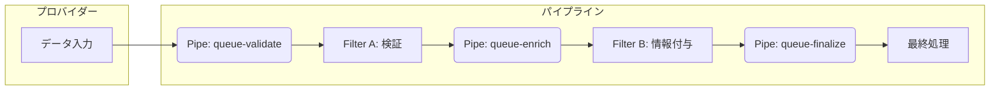
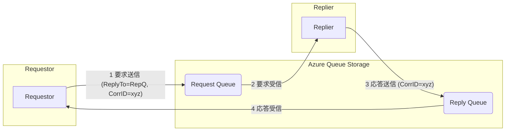

# **Azure Queue Storage によるメッセージングパターン実践2**

## **1. 概要**

本ハンズオンは、Azure Queue Storageを利用したメッセージングパターンの応用編です。「メッセージングパターン実践1」で学んだパターンに続き、今回はより複雑なデータ処理フローや非同期通信における双方向対話を実現するための、以下の2つの高度なパターンを実践的に学習します。

* **パイプ＆フィルター (Pipes and Filters) パターン**: 一連の独立した処理を連結させ、データ処理パイプラインを構築する。  
* **要求/応答 (Request/Reply) パターン**: 非同期メッセージング上で、同期的なリクエスト/レスポンスの対話を実現する。

これらのパターンを習得することで、マイクロサービスアーキテクチャなどで見られる、より高度なアプリケーション間連携を設計・実装できるようになります。

### **学習目標**

* パイプ＆フィルターパターンの概念を理解し、Queue Storageで実装できる。  
* 要求/応答パターンの概念を理解し、Queue Storageで実装できる。

### **前提条件**

* Python 3.8 以降  
* Azure Storage アカウントと接続文字列

#### **プロジェクトのセットアップ**

本ハンズオンでは、「メッセージングパターン実践1」で使用したプロジェクトを継続して利用します。第3回から初めて参加される方は、以下の手順で環境設定を行ってください。「メッセージングパターン実践1」に参加された方は、既存のプロジェクトと仮想環境をそのままお使いいただけます。

1. プロジェクトディレクトリの作成  
まず、このハンズオン用のディレクトリを作成して移動します。  
```
mkdir queue-pattern-azure  
cd queue-pattern-azure
```
2. 仮想環境の作成と有効化  
次に、プロジェクトごとに独立したPython環境を用意するため、仮想環境を作成し、有効化（アクティベート）します。  
```
# 仮想環境を作成 (venvという名前のディレクトリが作成されます)  
python -m venv venv
```
# 仮想環境を有効化 (OSに応じてコマンドを選択)  

```
# Windows (コマンドプロンプト / PowerShell):  
venv\Scripts\activate  
```
```
# macOS / Linux (bash/zsh):  
source venv/bin/activate
```
コマンドプロンプトの先頭に (venv) と表示されれば、仮想環境は正常に有効化されています。

3. 必要なライブラリのインストール  
有効化された仮想環境で、以下のコマンドを実行して本ハンズオンで必要なライブラリをインストールします。  
```
pip install azure-storage-queue python-dotenv
```
4. .envファイルの作成  
Azureの接続文字列のような機密情報をコードに直接書き込むのを避けるため、.envファイルを使用します。プロジェクトのルートディレクトリ（queue-pattern-azure）に.envという名前でファイルを作成し、以下の内容を記述してください。  
```
# .env  
AZURE_STORAGE_CONNECTION_STRING="<YOUR_CONNECTION_STRING>"
```
**注意:** <YOUR_CONNECTION_STRING> の部分を、ご自身のAzure Storageの接続文字列に置き換えてください。

## **2. パイプ＆フィルター (Pipes and Filters) パターン**

### **2.1. 概念**

パイプ＆フィルターパターンは、複雑なタスクを、一連の独立した再利用可能なコンポーネント（**フィルター**）に分割する設計です。各フィルターの出力は、次のフィルターの入力となり、この一連の繋がりを**パイプ**と呼びます。Azure Queue Storageでは、キューがパイプの役割を果たします。

例えば、「注文データを受け取り、検証し、顧客情報を付与し、最終処理を行う」といった一連のフローを、それぞれ独立したフィルターとして実装できます。

**利点:**

* **柔軟性**: 各フィルターは独立しているため、個別に修正、デプロイ、スケールできます。  
* **再利用性**: 汎用的なフィルター（例：データ圧縮、ログ記録）は、他のパイプラインでも再利用できます。  
* **並列処理**: 各フィルターは並行して動作できるため、システム全体のスループットを向上させることが可能です。



### **2.2. ハンズオン演習**

注文処理パイプラインを実装してみましょう。

1. **プロデューサー**: 注文データを最初のキューに送信します。  
2. **フィルターA**: 注文データを検証し、問題なければ次のキューに流します。  
3. **フィルターB**: 検証済みデータに処理日時を付与し、最終キューに流します。  
4. **最終コンシューマー**: 処理が完了した注文データを受信します。

#### **ステップ1: プロデューサーの作成 (pipe_producer.py)**
```python
# pipe_producer.py  
import os  
import json  
from azure.storage.queue import QueueClient  
from dotenv import load_dotenv

load_dotenv()  
connect_str = os.getenv("AZURE_STORAGE_CONNECTION_STRING")  
if not connect_str:  
    raise ValueError("AZURE_STORAGE_CONNECTION_STRING is not set.")

# パイプラインの最初のキュー  
queue_name = "queue-validate"  
queue_client = QueueClient.from_connection_string(connect_str, queue_name)

try:  
    queue_client.create_queue()  
    print(f"Queue '{queue_name}' created.")  
except Exception:  
    pass

# 処理する注文データ  
order_data = {"order_id": "ORD-123", "amount": 25000, "items": ["item-A", "item-B"]}

print("Sending order to the pipeline...")  
queue_client.send_message(json.dumps(order_data))  
print(f"-> Sent to '{queue_name}': {order_data}")

print("Producer finished.")
```
#### **ステップ2: フィルターA（検証）の作成 (filter_validate.py)**
```python
# filter_validate.py  
import os  
import json  
import time  
from azure.storage.queue import QueueClient  
from dotenv import load_dotenv

load_dotenv()  
connect_str = os.getenv("AZURE_STORAGE_CONNECTION_STRING")  
if not connect_str:  
    raise ValueError("AZURE_STORAGE_CONNECTION_STRING is not set.")

# 入力と出力のキュー  
input_queue_name = "queue-validate"  
output_queue_name = "queue-enrich"  
input_client = QueueClient.from_connection_string(connect_str, input_queue_name)  
output_client = QueueClient.from_connection_string(connect_str, output_queue_name)  
try:  
    output_client.create_queue()  
except Exception:  
    pass

print("[Filter A: Validate] Waiting for messages...")

while True:  
    messages = input_client.receive_messages()  
    for msg in messages:  
        print(f"[Filter A] Received: {msg.content}")  
        order = json.loads(msg.content)

        # 検証ロジック (ここでは金額が0より大きいかチェック)  
        if order.get("amount", 0) > 0:  
            print("[Filter A] Validation successful. Passing to next filter.")  
            output_client.send_message(msg.content)  
        else:  
            print("[Filter A] Validation failed. Discarding message.")  
          
        input_client.delete_message(msg.id, msg.pop_receipt)  
    time.sleep(5)
```
#### **ステップ3: フィルターB（情報付与）の作成 (filter_enrich.py)**
```python
# filter_enrich.py  
import os  
import json  
import time  
from datetime import datetime  
from azure.storage.queue import QueueClient  
from dotenv import load_dotenv

load_dotenv()  
connect_str = os.getenv("AZURE_STORAGE_CONNECTION_STRING")  
if not connect_str:  
    raise ValueError("AZURE_STORAGE_CONNECTION_STRING is not set.")

# 入力と出力のキュー  
input_queue_name = "queue-enrich"  
output_queue_name = "queue-finalize"  
input_client = QueueClient.from_connection_string(connect_str, input_queue_name)  
output_client = QueueClient.from_connection_string(connect_str, output_queue_name)  
try:  
    output_client.create_queue()  
except Exception:  
    pass

print("[Filter B: Enrich] Waiting for messages...")

while True:  
    messages = input_client.receive_messages()  
    for msg in messages:  
        print(f"[Filter B] Received: {msg.content}")  
        order = json.loads(msg.content)

        # 情報を付与  
        order["processed_at"] = datetime.utcnow().isoformat()  
        print(f"[Filter B] Enriched data. Passing to final queue.")  
          
        output_client.send_message(json.dumps(order))  
        input_client.delete_message(msg.id, msg.pop_receipt)  
    time.sleep(5)
```
#### **ステップ4: 最終コンシューマーの作成 (final_consumer.py)**
```python
# final_consumer.py  
import os  
import time  
from azure.storage.queue import QueueClient  
from dotenv import load_dotenv

load_dotenv()  
connect_str = os.getenv("AZURE_STORAGE_CONNECTION_STRING")  
if not connect_str:  
    raise ValueError("AZURE_STORAGE_CONNECTION_STRING is not set.")

queue_name = "queue-finalize"  
queue_client = QueueClient.from_connection_string(connect_str, queue_name)

print("[Final Consumer] Waiting for processed messages...")

while True:  
    messages = queue_client.receive_messages()  
    for msg in messages:  
        print(f"[Final Consumer] Fully processed message received: {msg.content}")  
        queue_client.delete_message(msg.id, msg.pop_receipt)  
    time.sleep(5)
```
#### **ステップ5: 実行と確認**

1. **ターミナルを3つ**開き、それぞれでフィルターA、フィルターB、最終コンシューマーを起動します。  
   ターミナル1  
   ```
   python filter_validate.py  
   ```
   ターミナル2  
   ```
   python filter_enrich.py  
   ```
   ターミナル3  
   ```
   python final_consumer.py
   ```
2. **4つ目のターミナル**でプロデューサーを実行し、パイプラインを開始します。  
   ```
   python pipe_producer.py
   ```
メッセージが各フィルターを順番に通過し、情報が付与され、最終的にコンシューマーに受信されることを確認できます。

## **3. 要求/応答 (Request/Reply) パターン**

### **3.1. 概念**

要求/応答パターンは、非同期メッセージングシステム上で、クライアント（要求元）がサービス（応答元）に処理を依頼し、その結果を受け取るという同期的な対話を実現するための設計です。

実装には通常、以下の要素が使われます。

* **要求キュー (Request Queue)**: 要求元がメッセージを送信する、よく知られたキュー。  
* **応答キュー (Reply Queue)**: 応答元が結果を返すための一時的なキュー。通常、要求元が動的に作成します。  
* **相関ID (Correlation ID)**: 要求と応答を紐付けるための一意なID。要求元が生成し、メッセージに含めます。

### **3.2. ハンズオン演習**

#### **ステップ1: 応答側（Replier）の作成 (replier.py)**

要求キューを監視し、受け取ったメッセージを処理して、指定された応答キューに結果を返します。
```python
# replier.py  
import os  
import json  
import time  
import uuid  
from azure.storage.queue import QueueClient  
from dotenv import load_dotenv

load_dotenv()  
connect_str = os.getenv("AZURE_STORAGE_CONNECTION_STRING")  
if not connect_str:  
    raise ValueError("AZURE_STORAGE_CONNECTION_STRING is not set.")

request_queue_name = "request-queue"  
request_client = QueueClient.from_connection_string(connect_str, request_queue_name)  
try:  
    request_client.create_queue()  
except Exception:  
    pass

print("[Replier] Waiting for requests...")

while True:  
    messages = request_client.receive_messages()  
    for msg in messages:  
        print(f"[Replier] Request received: {msg.content}")  
          
        try:  
            req_data = json.loads(msg.content)  
            reply_to = req_data.get("reply_to")  
            correlation_id = req_data.get("correlation_id")  
            payload = req_data.get("payload")

            if not all([reply_to, correlation_id, payload]):  
                raise ValueError("Invalid request message")

            # 処理を実行 (例: 文字列を大文字にする)  
            result = str(payload).upper()  
              
            # 応答メッセージを作成  
            res_data = {"result": result, "correlation_id": correlation_id}  
              
            # 応答キューに結果を送信  
            reply_client = QueueClient.from_connection_string(connect_str, reply_to)  
            reply_client.send_message(json.dumps(res_data))  
            print(f"[Replier] Sent reply to '{reply_to}': {res_data}")

        except Exception as e:  
            print(f"[Replier] Error processing message: {e}")

        finally:  
            request_client.delete_message(msg.id, msg.pop_receipt)  
              
    time.sleep(3)
```
#### **ステップ2: 要求側（Requestor）の作成 (requestor.py)**

一意な応答キューを作成し、要求を送信後、そのキューで応答を待ち受けます。
```python
# requestor.py  
import os  
import json  
import time  
import uuid  
from azure.storage.queue import QueueClient  
from dotenv import load_dotenv

load_dotenv()  
connect_str = os.getenv("AZURE_STORAGE_CONNECTION_STRING")  
if not connect_str:  
    raise ValueError("AZURE_STORAGE_CONNECTION_STRING is not set.")

# 要求キュー  
request_queue_name = "request-queue"  
request_client = QueueClient.from_connection_string(connect_str, request_queue_name)

# 一意な応答キューを作成  
reply_queue_name = f"reply-queue-{uuid.uuid4()}"  
reply_client = QueueClient.from_connection_string(connect_str, reply_queue_name)  
reply_client.create_queue()

print(f"[Requestor] Created reply queue: '{reply_queue_name}'")

# 要求メッセージを作成  
correlation_id = str(uuid.uuid4())  
request_payload = "hello world"  
req_data = {  
    "payload": request_payload,  
    "reply_to": reply_queue_name,  
    "correlation_id": correlation_id  
}

print(f"[Requestor] Sending request with Correlation ID: {correlation_id}")  
request_client.send_message(json.dumps(req_data))

# 応答を待つ  
print("[Requestor] Waiting for reply...")  
response_received = False  
for i in range(10): # タイムアウト (約50秒)  
    messages = reply_client.receive_messages()  
    for msg in messages:  
        res_data = json.loads(msg.content)  
        # 相関IDが一致するか確認  
        if res_data.get("correlation_id") == correlation_id:  
            print(f"[Requestor] Reply received: {res_data.get('result')}")  
            response_received = True  
            reply_client.delete_message(msg.id, msg.pop_receipt)  
            break  
    if response_received:  
        break  
    time.sleep(5)

if not response_received:  
    print("[Requestor] Timed out waiting for a reply.")

# 一時的な応答キューを削除  
print("[Requestor] Deleting reply queue.")  
reply_client.delete_queue()
```
#### **ステップ3: 実行と確認**

1. **1つ目のターミナル**で、応答側（Replier）を先に起動します。  
   ```
   python replier.py
   ```

2. **2つ目のターミナル**で、要求側（Requestor）を実行します。  
   ```
   python requestor.py
   ```
Requestorが要求を送信し、Replierがそれを受け取って処理し、結果を返す一連の流れが確認できます。Requestorは無事に応答を受け取ると、一時的に作成した応答キューを削除して終了します。

## **4. まとめ**

本ハンズオンでは、以下の2つの高度なメッセージングパターンについて学習しました。

1. **パイプ＆フィルター**: 複数のキューを「パイプ」として利用し、独立した処理コンポーネント（フィルター）を連結させることで、柔軟でスケーラブルなデータ処理パイプラインを構築しました。  
2. **要求/応答**: 要求キューと動的な応答キュー、そして相関IDを組み合わせることで、非同期メッセージング上で同期的なリクエスト/レスポンス型の対話を実現しました。

これらのパターンは、個々のサービスを疎結合に保ちつつ、協調して動作させるための強力な手段となります。

### **発展的なトピック**

* **エラーハンドリング**: パイプラインの途中で処理が失敗した場合、どのように補償処理を行うか？（Dead-Letter Queueの活用など）  
* **パフォーマンス**: 各キューやフィルターの性能を監視し、ボトルネックを特定してスケールさせる方法。