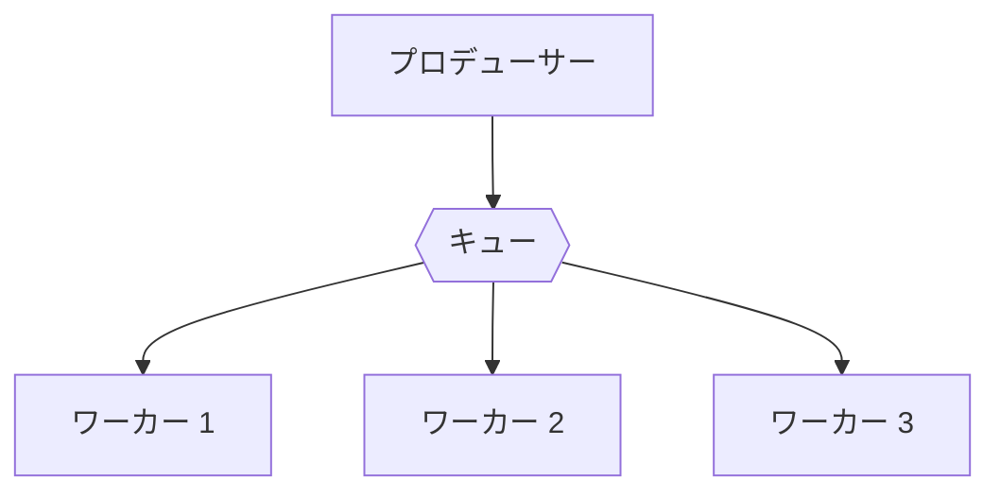
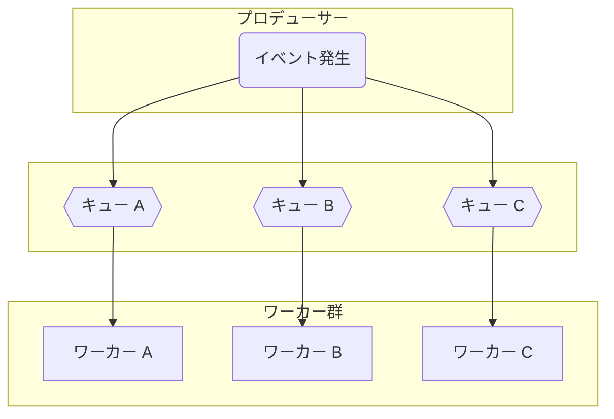
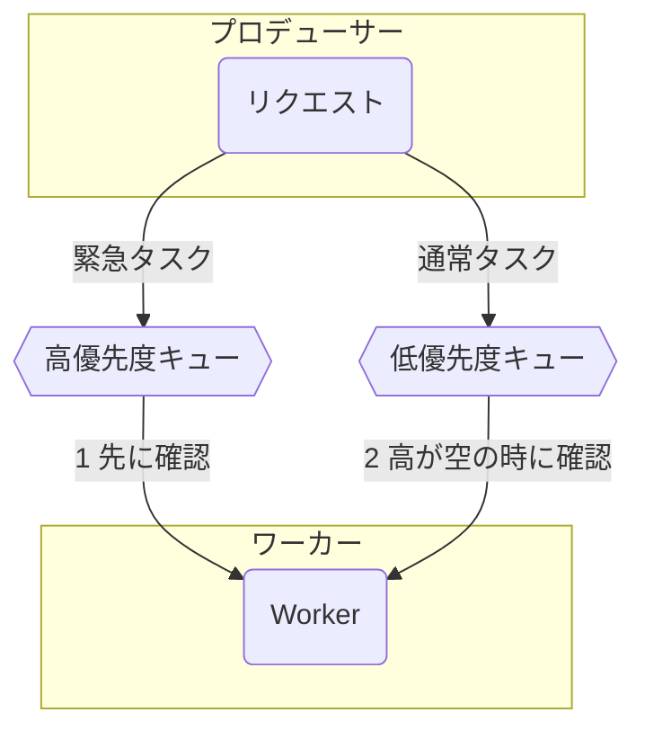
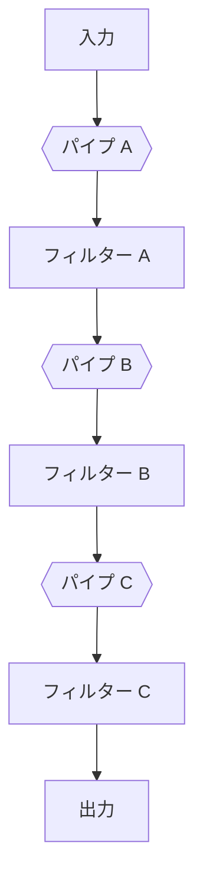
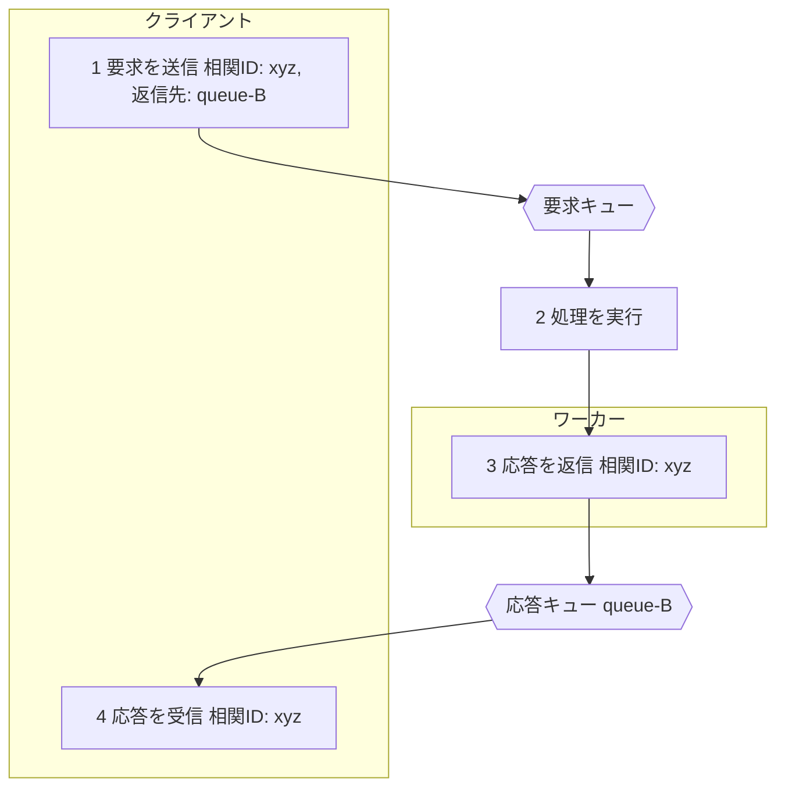

# **Queueベースのシステム設計パターン**

## **はじめに**

キュー（Queue）は、単に処理を非同期化するためだけの道具ではありません。様々なパターンを適用することで、システムの**スケーラビリティ（拡張性）**、**回復性（障害耐性）**、**保守性**を劇的に向上させることができます。

この資料では、クラウドアプリケーション開発で頻繁に利用される、キューをベースとした代表的な設計パターンを5つ紹介します。これらのパターンは、システムアーキテクトが問題を解決するための共通言語であり、知っておくことで、より洗練されたシステムを設計できるようになります。

## **1. 競合コンシューマー (Competing Consumers) パターン**

1つのキューに投入されたタスク（メッセージ）を、**同じ能力を持つ複数のワーカー（コンシューマー）**が「早い者勝ち」で取得し、並行して処理するパターンです。  
どういう時に使うか？  
大量に発生する、同じ種類の独立したタスクを、並列処理して高速にさばきたい場合に最も効果を発揮します。

* **画像のサムネイル生成:** 大量の画像リサイズ処理を、複数のワーカーで分担する。  
* **ログデータの集計:** リアルタイムで発生する大量のアクセスログを、遅延なく処理する。  
* **バッチ処理:** 夜間に実行するデータ変換や集計タスクを、並列実行して時間を短縮する。

**ポイント**

* **スケーラビリティ:** 処理が追いつかなくなったら、ワーカーの数を増やすだけでシステム全体の処理能力を簡単に向上（スケールアウト）できます。  
* **回復性:** 1つのワーカーが停止しても、他のワーカーが処理を引き継ぐため、システム全体が停止することがありません。

**構成図**

## **2. ファンアウト (Fan-out) パターン**

1つの出来事（イベント）をきっかけに、複数の異なる種類の処理を、それぞれ独立したワーカーで並行して実行するパターンです。Pub/Sub（パブリッシュ/サブスクライブ）モデルの一種です。  
どういう時に使うか？  
1つのアクションが、複数の異なるビジネスプロセスを誘発する場合に使われます。

* **ユーザー登録:** 1人のユーザーが登録されると、「ウェルカムメール送信」「分析DBへの記録」「管理者への通知」が同時に実行される。  
* **ECサイトの注文確定:** 注文が確定すると、「在庫引き当て」「決済処理」「発送システムへの連携」が並行して開始される。

**ポイント**

* **関心の分離:** 各処理が完全に独立しているため、例えば「メール送信の仕組みだけ」を後から変更しても、他の処理に一切影響を与えません。システムの保守性が向上します。  
* **耐障害性:** メール送信ワーカーが停止しても、在庫引き当てや決済処理は問題なく動き続けます。

**構成図**

## **3. 優先度付きキュー (Priority Queue) パターン**
 
メッセージの重要度に応じて、優先度の高いタスクを低いタスクよりも先に処理するためのパターンです。  
どういう時に使うか？  
ビジネス要件として、タスクの処理順序を制御する必要がある場合に使われます。

* **SLA（サービス品質保証）の違い:** 有料会員からのリクエストを、無料会員のリクエストよりも優先的に処理する。  
* **タスクの緊急性:** 通常のデータ更新処理よりも、緊急のセキュリティパッチ適用やパスワードリセット通知を優先する。

**ポイント**

* **実現方法:** 最もシンプルな方法は、優先度ごとにキューを分けることです（例：「高」「中」「低」）。ワーカーは常に高優先度のキューから確認し、空であれば中、低と順番に確認していきます。  
* **注意点:** 低優先度のタスクが、高優先度のタスクが来続けることによって全く処理されない「飢餓状態（Starvation）」に陥る可能性があります。これを防ぐため、定期的に低優先度キューも確認するなどの対策が必要です。

**構成図（複数キュー方式）**

## **4. パイプ＆フィルター (Pipes and Filters) パターン**

一連の処理を複数の独立したステップ（フィルター）に分割し、キュー（パイプ）で繋いで流れ作業のように実行するパターンです。1つのフィルターの出力が、次のフィルターの入力となります。  
どういう時に使うか？  
明確な順序を持つ、一連のデータ処理ワークフローを構築する場合に使われます。

* **ETL処理:** データの「抽出(Extract)」「変換(Transform)」「格納(Load)」を、それぞれのステップに分割する。  
* **動画処理パイプライン:** 「①アップロード完了」→「②ウイルススキャン」→「③フォーマット変換」→「④公開」といった一連の流れを構築する。

**ポイント**

* **再利用性と柔軟性:** 各フィルターは独立しているため、個別にテストや修正が容易です。また、フィルターの順序を入れ替えたり、新しいフィルターを追加したりすることも比較的簡単に行えます。  
* **スケーラビリティ:** 特定のステップ（例えば、フォーマット変換）だけがボトルネックになっている場合、そのステップのワーカーだけを増やす（競合コンシューマーを適用する）といった柔軟な対応が可能です。

**構成図**

## **5. 要求/応答 (Request/Reply) パターン**

非同期の仕組みを使いながら、あたかも同期的のようなリクエストとレスポンスを実現するためのパターンです。処理に時間がかかるが、後で必ず結果を知りたい場合に使われます。  
**どういう時に使うか？**

* **長時間実行ジョブの起動と結果取得:** Web APIから重いレポート生成ジョブを起動し、完了後に結果のダウンロードURLを受け取る。  
* **モバイルアプリからのバックエンド処理依頼:** アプリから「ローンの仮審査」をリクエストし、数分後に結果をプッシュ通知で受け取る。

**ポイント**

* **相関ID (Correlation ID):** どのリクエストに対する応答なのかを紐付けるために、一意のID（相関ID）を使います。  
* **返信先キュー (Reply-To Queue):** リクエストメッセージの中に、ワーカーが応答を返すためのキューのアドレスを含めておきます。

**構成図**
