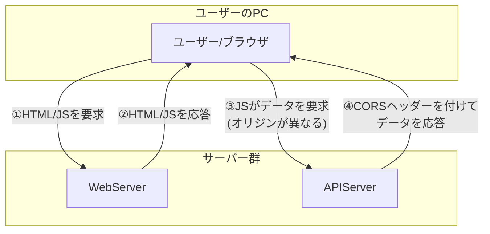
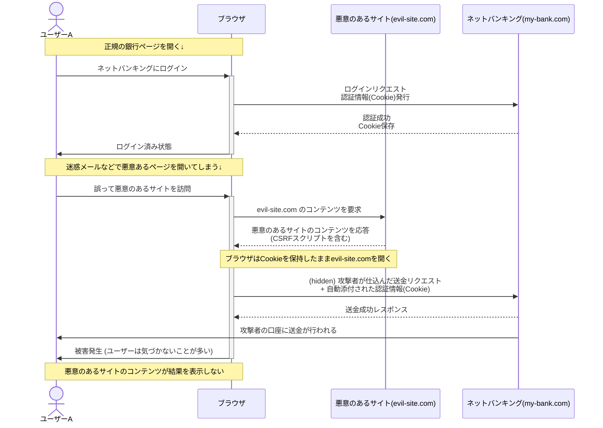

## **Webシステム開発：CORS（オリジン間リソース共有）を理解しよう**

### **1. はじめに：なぜCORSが必要なのか？**

現代のWebシステム開発では、機能ごとにサーバーを分けるのが一般的です。例えば、ユーザーがブラウザで見る画面（HTMLやJavaScript）を**Webサーバー**から提供し、画面で表示するためのデータ（JSON形式など）は**APIサーバー**から取得する、という構成です。

この構成では、ブラウザで動作するJavaScriptが、自分を配信したWebサーバーとは**異なる場所（オリジン）にあるAPIサーバー**へ通信する必要があります。

しかし、Webブラウザにはセキュリティを守るための **「同一オリジンポリシー（Same-Origin Policy）」** という重要な制約があります。この制約により、原則として異なるオリジンへの通信はブロックされてしまいます。

そこで、この制約を安全に乗り越え、WebサーバーとAPIサーバー間の通信を実現するための仕組みが**CORS (Cross-Origin Resource Sharing)** なのです。

### **2. 同一オリジンポリシー（Same-Origin Policy）とは？**

#### **2.1. オリジンとは？**

「オリジン（Origin）」とは、URLの以下の3つの組み合わせで判断されます。

* **プロトコル** (例: https, http)  
* **ホスト** (例: my-app.com, api.my-app.com)  
* **ポート番号** (例: 443, 8000)

これら3つが完全に一致する場合に「同一オリジン」とみなされます。

**具体例：Webサーバー (https://my-app.com) からAPIサーバーへのリクエスト**

Webサーバーの https://my-app.com/index.html に配置されたJavaScriptが、様々なURLへアクセスする場合を考えてみましょう。

| 通信先のURL | オリジン | 同一オリジンか？ | 理由 |
| :---- | :---- | :---- | :---- |
| https://my-app.com/css/style.css | https://my-app.com | ✔️ はい | プロトコル、ホスト、ポートが全て同じ（Webサーバー内での通信） |
| https://api.my-app.com/data.json | https://api.my-app.com | ❌ いいえ | ホストが異なる (APIサーバーへの通信) |
| http://my-app.com | http://my-app.com | ❌ いいえ | プロトコルが異なる (https vs http) |
| https://my-app.com:8000 | https://my-app.com:8000 | ❌ いいえ | ポート番号が異なる (暗黙の443 vs 8000) |

このように、WebサーバーとAPIサーバーはホスト名が異なるため、「異なるオリジン」となります。

#### **2.2. 同一オリジンポリシーの目的**

Webブラウザには、セキュリティの根幹をなす **「同一オリジンポリシー」** という基本的なルールがあります。

同一オリジンポリシーは、**「あるオリジンから読み込まれたスクリプトは、そのオリジンから読み込まれたリソースにしかアクセスできない」** という制限です。

もしこのポリシーがなければ、悪意のあるWebサイト（evil.com）にアクセスしただけで、裏で勝手にあなたのSNS（social.com）やネットバンキング（bank.com）の情報を盗み見たり、操作したりできてしまいます。ブラウザがこのルールを守ることで、私たちは安全にインターネットを利用できるのです。

**もしAPIアクセスを制限しなかったら？：「クロスサイトリクエストフォージェリ（CSRF）」の脅威**

APIを開発する際、「どこからでもアクセスできて便利だから」とアクセス制限をかけないと、非常に危険です。その代表的な攻撃手法が**「クロスサイトリクエストフォージェリ（CSRF）」**です。

**CSRF攻撃の簡単なシナリオ**

1. **準備**: ユーザーAさんは、ネットバンキングサイト my-bank.com にログインしています。ブラウザは my-bank.com のログイン情報（Cookie）を保持しています。  
2. **罠**: ユーザーAさんが、攻撃者が作った悪意のあるサイト evil-site.com を開いてしまいます。このサイトには、ユーザーAさんの目には見えない形で、次のようなリクエストを送信するスクリプトが埋め込まれています。  
```javascript
   // 悪意のあるサイトのスクリプト  
   // my-bank.com の送金APIを勝手に呼び出す  
   fetch('[https://my-bank.com/api/transfer](https://my-bank.com/api/transfer)', {  
       method: 'POST',  
       body: JSON.stringify({ to: 'attacker_account', amount: 100000 })  
   });
```
3. **実行**: ユーザーAさんのブラウザは、このリクエストを my-bank.com に送信します。その際、ブラウザは**自動的に my-bank.com のログイン情報（Cookie）をリクエストに添付**してしまいます。  
4. **被害**: my-bank.com のサーバーは、正規のログイン情報が付与されたリクエストを受け取るため、「ユーザーAさん本人からの送金指示だ」と勘違いしてしまい、攻撃者の口座に10万円を送金してしまいます。



これがCSRFの恐ろしさです。ユーザーは罠サイトを見ただけで、意図しない操作を強制させられてしまうのです。

## **3. 安全なクロスオリジン通信：「CORS（Cross-Origin Resource Sharing）」**

しかし、実際には https://app.example.com から https://api.example.com のように、異なるオリジン間でAPI通信を行いたいケースは多くあります。

そのために用意された仕組みが**「CORS（オリジン間リソース共有）」**です。

CORSは、サーバー側が**「このオリジンからのリクエストなら受け入れてもいいですよ」**という許可リストをブラウザに伝える仕組みです。

サーバーは、HTTPレスポンスヘッダーに特定の情報を付与して、アクセス許可を伝えます。

* ```Access-Control-Allow-Origin: https://trusted-site.com  ```
  * https://trusted-site.com という特定のオリジンからのアクセスを許可します。これが最も安全で基本的な設定です。  
* ```Access-Control-Allow-Origin: * ```
  * **（危険！）** すべてのオリジンからのアクセスを許可します。この設定は、誰でもアクセスできる公開API（天気情報APIなど、個人情報を含まないもの）以外では**絶対に使用してはいけません**。認証が必要なAPIでこの設定を使うと、CSRF攻撃の標的になります。

ブラウザは、APIにリクエストを送る前に、レスポンスヘッダーを見て、アクセスが許可されているオリジンかどうかを確認します。許可されていなければ、たとえスクリプトがリクエストを送信しようとしても、ブラウザがそのレスポンスの読み込みをブロックしてくれます。


### **3. CORSの仕組み：APIサーバーはどのように通信を許可するのか**

CORSは、APIサーバーが「このオリジンからのリクエストなら受け入れても安全ですよ」とブラウザに教えることで、クロスオリジン通信を許可する仕組みです。このやり取りは**HTTPヘッダー**を介して行われます。

CORSにおけるリクエストは、主に「単純リクエスト」と「プリフライトリクエスト」の2種類に分類されます。

#### **3.1. 単純リクエスト (Simple Request)**

GETメソッドによるデータ取得など、サーバーへの影響が比較的小さいとみなされるリクエストです。

* **通信の流れ (成功する場合):**  
  1. **ブラウザ**: Webサーバー (https://my-app.com) から読み込まれたJavaScriptが、APIサーバー (https://api.my-app.com) へデータを要求します。このとき、ブラウザはリクエストヘッダーに自身の出身地を示す Origin ヘッダーを自動的に付与します。  
    ```
     GET /users HTTP/1.1  
     Host: api.my-app.com  
     Origin: https://my-app.com
    ```
  2. **APIサーバー**: リクエストを受け取り、Origin ヘッダーの値（https://my-app.com）を確認します。このオリジンからのアクセスを許可する設定になっていれば、レスポンスヘッダーに Access-Control-Allow-Origin を含めて返します。
    ```  
     HTTP/1.1 200 OK  
     Access-Control-Allow-Origin: https://my-app.com  
     Content-Type: application/json

     { "users": [...] }
    ```
  3. **ブラウザ**: レスポンスヘッダーに Access-Control-Allow-Origin があり、その値が自身のオリジンと一致することを確認して、初めてJavaScriptにJSONデータを渡します。  
* **通信がブロックされる経緯 (CORSエラー):**  
  1. **ブラウザ**は上記と同様に Origin ヘッダーを付けてリクエストを送信します。  
  2. **APIサーバー**はリクエストを受け取りますが、CORS設定がされていないため、Access-Control-Allow-Origin ヘッダーを含めずに応答します。  
  3. **ブラウザ**はAPIサーバーからの応答を受け取ります。しかし、レスポンスヘッダーに**期待していた Access-Control-Allow-Origin が見つかりません。**  
  4. ブラウザはこれを「オリジンが異なるため、セキュリティ上危険な可能性がある通信」と判断します。  
  5. 安全のため、**ブラウザは受け取ったレスポンス（データ）をJavaScriptに渡さずに破棄**します。  
  6. そして、開発者コンソールにCORSエラーメッセージを表示します。これが、よく目にするCORSエラーの正体です。

#### **3.2. プリフライトリクエスト (Preflight Request)**

DELETEメソッドによるデータ削除や、application/json形式でのデータ登録など、サーバーの状態を変更する可能性のあるリクエストでは、安全のため**本番のリクエストの前に「プリフライト（事前確認）」リクエスト**が自動的に送信されます。

* **通信の流れ (成功する場合):**  
  1. **ブラウザ (プリフライト)**: OPTIONS メソッドを使い、「これからDELETEメソッドでリクエストを送りたいのですが、許可されていますか？」とAPIサーバーに問い合わせます。  
    ```
     OPTIONS /users/123 HTTP/1.1  
     Host: api.my-app.com  
     Origin: https://my-app.com  
     Access-Control-Request-Method: DELETE
    ```
  2. **APIサーバー (プリフライトへの応答)**: 「はい、DELETEメソッドは許可していますよ」という返事を、許可するメソッドの一覧などをヘッダーに含めて返します。 
    ``` 
     HTTP/1.1 204 No Content  
     Access-Control-Allow-Origin: https://my-app.com  
     Access-Control-Allow-Methods: GET, POST, DELETE  
     Access-Control-Max-Age: 86400
    ```
  3. **ブラウザ (本番リクエスト)**: プリフライトの応答で許可が確認できたので、本番のDELETEリクエストをAPIサーバーに送信します。  
  4. **APIサーバー (本番リクエストへの応答)**: リクエストを処理し、結果を返します。  
* **通信がブロックされる経緯 (CORSエラー):**  
  1. **ブラウザ**は上記と同様にプリフライトリクエストを送信します。  
  2. **APIサーバー**はCORS設定が不十分で、例えば Access-Control-Allow-Methods に DELETE を含めずに応答したとします。  
  3. **ブラウザ**はプリフライトへの応答をチェックし、送ろうとしていたDELETEメソッドが許可されていないことを確認します。  
  4. ブラウザは「このリクエストは許可されていない」と判断し、**本番のリクエスト（DELETE）を送信することなく、その場で処理を中止します。**  
  5. そして、開発者コンソールにCORSエラーメッセージを表示します。

### **4. CORSエラーの主な原因と解決策**

開発中にブラウザのコンソールでこのエラーを見たら、CORSが原因です。

Access to fetch at 'https://api.my-app.com/users' from origin 'https://my-app.com' has been blocked by CORS policy: No 'Access-Control-Allow-Origin' header is present on the requested resource.

これは、「https://my-app.com からのリクエストに対して、APIサーバーからの応答をチェックした**ブラウザが**、セキュリティポリシー（CORS）に基づき通信をブロックした」という最終結果を示すメッセージです。

* **原因:**  
  * **APIサーバーにCORSの設定がされていない。** これが最も多い原因です。APIサーバーが、どのWebサーバーからのアクセスを許可するのかを知らない状態です。  
  * 許可リストに登録されていないWebサーバーからのアクセス。  
* **解決策:**  
  * **APIサーバー側でCORS設定を行う。** これが根本的な解決策です。  
  * APIサーバーのプログラムで、「Origin: https://my-app.com」というリクエストが来たら、「Access-Control-Allow-Origin: https://my-app.com」というレスポンスヘッダーを返すように設定します。  
  * 多くのWebフレームワークには、CORS設定を簡単に行うためのライブラリやミドルウェアが用意されています。

#### **4.1. クロスオリジンを許可する具体的な設定例**

CORSの設定は、HTMLやJavaScriptを配置しているWebサーバー側ではなく、**JSONなどのデータを提供するAPIサーバー側で行う必要があります。**

ここでは、APIサーバーがNode.jsとExpressフレームワークで構築されている場合の具体的な設定例を紹介します。

**例：Node.js (Express) で構築されたAPIサーバーの設定**

cors というミドルウェアパッケージを利用するのが最も簡単です。
```JavaScript
// ターミナルでインストール  
// npm install cors

const express = require('express');  
const cors = require('cors');  
const app = express();

// 許可したいオリジンを指定  
const corsOptions = {  
  origin: 'https://my-app.com', // ここにWebサーバーのオリジンを記述  
  optionsSuccessStatus: 200  
};

// corsミドルウェアを適用  
app.use(cors(corsOptions));

// これ以降のルート定義でCORSが有効になる  
app.get('/users', (req, res) => {  
  res.json({ message: 'CORS is enabled!' });  
});

app.listen(8000, () => {  
  console.log('API server listening on port 8000');  
});
```
### **5. まとめ**

* Webシステムは**Webサーバー**と**APIサーバー**に分かれていることが多い。  
* ブラウザの**同一オリジンポリシー**により、WebサーバーからAPIサーバーへの通信はそのままではブロックされる。  
* **CORS**は、**APIサーバー側**に「このWebサーバーからの通信は許可します」という設定（HTTPヘッダー）を追加することで、安全なクロスオリジン通信を実現する仕組み。  
* CORSエラーは、**APIサーバー側の設定不備**が原因。フロントエンドのコード（JavaScript）を修正しても直らない。

CORSを正しく理解することは、WebサーバーとAPIサーバーを連携させるモダンなWebアプリケーション開発において不可欠な知識です。
