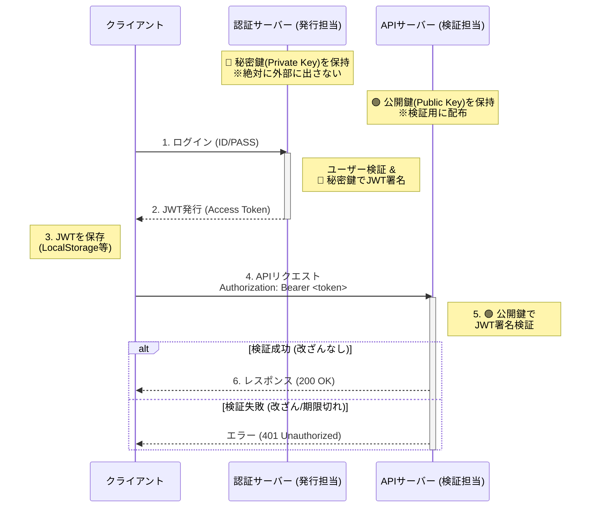

# Web API開発：JWTによる認証・認可の仕組みと実装 (Python版)  

## **はじめに**

現代のWebシステム開発、特にWeb APIの開発においては、リクエストごとに独立して処理を行う「ステートレス（無状態）」な設計が基本となります。これは、FlaskやFastAPI、DjangoなどのWebフレームワークを使う場合でも、Azure FunctionsやAWS Lambdaなどのサーバーレス環境を使う場合でも共通して求められる設計思想です。

従来のWebアプリでよく使われてきた「セッション認証（サーバー側でログイン状態を覚えている方式）」は、APIサーバーを複数台に増やしたり（スケーリング）、サーバーレス環境で動作させたりする際に管理が複雑になります。

そこで標準的に利用されているのが、**JWT（JSON Web Token）**を用いたトークンベースの認証です。このテキストでは、Web API開発において事実上の標準となっているJWTの仕組みと、Pythonでの安全な実装方法について学習します。

## **1. 認証と認可、そしてJWT**

### **1.1 ステートレスな認証とは**

Web API（RESTful API）では、サーバーはクライアントの過去の状態を記憶しないのが原則です。  
しかし、APIは「誰からのリクエストか」を知る必要があります。  
そのため、クライアント（ブラウザやスマホアプリ）からリクエストが来るたびに、「私は誰々です」というデジタルな証明書を毎回提示してもらう方式をとります。  
この方式は、特に**Azure Functions**のようなサーバーレス環境（リクエストが終わるとメモリがリセットされる環境）や、マイクロサービスアーキテクチャと非常に相性が良いです。

### **1.2 JWT（JSON Web Token）とは**

JWT（「ジョット」と読みます）は、認証情報をJSON形式で記述し、電子署名を付けてURLで送受信できる形式にエンコードしたものです。

**特徴:**

* **自己完結型:** ユーザーIDや有効期限などの情報がトークン自体に含まれているため、サーバーはデータベースに毎回問い合わせなくても「有効なトークンか」「誰のトークンか」を検証可能です。  
* **改ざん検知:** デジタル署名が施されているため、途中で中身が書き換えられると無効になります。  
* RS256 (非対称鍵) の採用:  
  本テキストでは、セキュリティ強度が高く推奨される**RS256（公開鍵暗号）**方式を採用します。  
  * **HS256 (共通鍵):** 発行者と検証者が同じ鍵を持つ。シンプルだが鍵管理が難しい。  
  * **RS256 (公開鍵暗号):** **秘密鍵**で署名し、**公開鍵**で検証する。APIサーバー（検証側）には公開鍵を置くだけで良いため、万が一APIサーバーがハッキングされても署名鍵は漏洩しません。

## **2. JWTの構造**

JWTは .（ドット）で区切られた3つの部分から成ります。

``` aaaaaa.bbbbbb.cccccc ```  
```（Header）.（Payload）.（Signature）```

### **(1) Header（ヘッダー）**

どんなアルゴリズムで署名しているかなどのメタ情報です。
```
{  
  "alg": "RS256",  
  "typ": "JWT"  
}
```
### **(2) Payload（ペイロード）**

ここにユーザー情報や有効期限などを入れます。**重要：ここは暗号化されていません（Base64エンコードされているだけ）。パスワードなどの秘密情報は絶対に入れてはいけません。**
```
{  
  "sub": "user123",        // ユーザーID (Subject)  
  "name": "Taro Yamada",   // 任意のデータ  
  "admin": true,           // 権限情報など  
  "exp": 1700000000        // 有効期限 (Expiration Time)  
}
```
### **(3) Signature（署名）**

HeaderとPayloadに対し、**発行者の秘密鍵**を使って署名を作成します。この署名は**公開鍵**を使えば誰でも「正しい発行者が作ったか」を検証できますが、秘密鍵がないと作成できません。

## **3. 認証のフロー (RS256版)**

Web APIにおける標準的な認証・認可のシーケンスは以下の通りです。  
「認証サーバー（発行）」と「APIサーバー（検証）」で、使用する鍵が異なる点に注目してください。  

1. **鍵ペアの準備:** 管理者があらかじめ秘密鍵と公開鍵のペアを作成しておく。  
2. **ログイン:** クライアントがID/PASSを送信。  
3. **発行:** 認証機能を持つサーバーが**秘密鍵**を使ってJWTを生成して返す。  
4. **保存:** クライアントはJWTを保存する（ブラウザならLocalStorageやCookieなど）。  
5. **利用:** クライアントはAPIへのリクエスト時、HTTPヘッダーにJWTを付けて送る。  
   * 一般的な形式: Authorization: Bearer <token>  
6. **検証:** APIサーバーは**公開鍵**を使ってJWTの署名を検証し、リクエストを許可するか判断する。

## **4. Pythonによる実装 (PyJWT with RS256)**

PythonでJWTを扱うには、デファクトスタンダードである PyJWT ライブラリを使用します。  
ここで紹介するコードは、Webフレームワーク（Flask, FastAPI, Djangoなど）や実行環境に関わらず使用できる汎用的なロジックです。

### **準備: ライブラリのインストール**

RSA暗号を扱うため、cryptography ライブラリへの依存が含まれます。
```
pip install pyjwt[crypto]
```
### **準備: 鍵ペア（秘密鍵・公開鍵）の生成**

開発環境（ターミナル）で openssl コマンドを使用して鍵ペアを生成します。

**1. 秘密鍵 (private_key.pem) の生成**
```
openssl genrsa -out private_key.pem 2048
```
**2. 公開鍵 (public_key.pem) の抽出**
```
openssl rsa -in private_key.pem -pubout -out public_key.pem
```
* private_key.pem: **重要機密**。発行サーバーのみに配置します。  
* public_key.pem: 検証を行う全てのAPIサーバーに配布します。

### **実装例1: トークンの生成（発行側 - 秘密鍵を使用）**
```python
import jwt  
import datetime  
import time

# 秘密鍵ファイルを読み込む  
with open("private_key.pem", "rb") as f:  
    PRIVATE_KEY = f.read()

# 署名に使用するアルゴリズム  
ALGORITHM = "RS256"

def create_token(user_id):  
    """  
    ユーザーIDを受け取り、秘密鍵で署名したJWTを発行する関数  
    """  
    now = int(time.time())  
      
    payload = {  
        "sub": user_id,  
        "iat": now,  
        "exp": now + (60 * 30)  # 30分有効  
    }

    # RS256でエンコード（署名）  
    token = jwt.encode(payload, PRIVATE_KEY, algorithm=ALGORITHM)  
      
    return token

# テスト実行  
generated_token = create_token("user001")  
print(f"Generated Token: {generated_token}")
```
### **実装例2: トークンの検証（検証側 - 公開鍵を使用）**
```python
# 公開鍵ファイルを読み込む  
with open("public_key.pem", "rb") as f:  
    PUBLIC_KEY = f.read()

# 検証時に許可するアルゴリズム（ホワイトリスト）  
ALLOWED_ALGORITHMS = ["RS256"]

def verify_token(token):  
    """  
    トークンを受け取り、公開鍵で検証してペイロードを返す関数  
    """  
    try:  
        # 公開鍵を使って署名を検証  
        payload = jwt.decode(token, PUBLIC_KEY, algorithms=ALLOWED_ALGORITHMS)  
        return payload

    except jwt.ExpiredSignatureError:  
        print("エラー: トークンの有効期限が切れています。")  
        return None  
    except jwt.InvalidTokenError as e:  
        print(f"エラー: 無効なトークンです。({e})")  
        return None

# テスト実行  
result = verify_token(generated_token)  
if result:  
    print(f"認証成功！ ユーザーID: {result['sub']}")
```
## **5. Web APIでの実装例 (Azure Functionsの場合)**

Web APIでJWT認証を行う基本的な流れは、どのフレームワークでも共通です。

1. HTTPリクエストのヘッダーから Authorization を取得する。  
2. Bearer <token> の形式からトークン部分を抜き出す。  
3. トークンを検証する（上記の verify_token ロジック）。  
4. 検証成功ならメインの処理を実行、失敗なら 401 Unauthorized を返す。

ここでは、ステートレスな実行環境の代表例として **Azure Functions (Python v2)** での実装を示します。
```python
import azure.functions as func  
import logging  
import jwt  
import os

app = func.FunctionApp(http_auth_level=func.AuthLevel.ANONYMOUS)

# 公開鍵の取得（環境変数やKey Vaultから読み込むのが一般的）  
PUBLIC_KEY = os.environ.get("JWT_PUBLIC_KEY")

# 許可するアルゴリズム  
ALLOWED_ALGORITHMS = ["RS256"]

@app.route(route="protected_api")  
def protected_api(req: func.HttpRequest) -> func.HttpResponse:  
    logging.info('Python HTTP trigger function processed a request.')

    # 1. Authorizationヘッダーの取得  
    auth_header = req.headers.get('Authorization')  
    if not auth_header:  
        return func.HttpResponse("Unauthorized: No token provided", status_code=401)

    try:  
        # 2. Bearerトークンの抽出  
        parts = auth_header.split()  
        if parts[0].lower() != "bearer":  
             raise ValueError("Invalid header format")  
        token = parts[1]

        # 3. トークンの検証（公開鍵を使用）  
        # PUBLIC_KEYはPEM形式の文字列である必要があります  
        payload = jwt.decode(token, PUBLIC_KEY, algorithms=ALLOWED_ALGORITHMS)  
          
        # 4. ビジネスロジックの実行  
        user_id = payload.get("sub")  
          
        # 例: 認証済みユーザーIDを使ってDB操作やQueueへのメッセージ送信を行う  
          
        return func.HttpResponse(f"Hello, {user_id}. Authenticated successfully!", status_code=200)

    except jwt.ExpiredSignatureError:  
        return func.HttpResponse("Unauthorized: Token expired", status_code=401)  
    except Exception as e:  
        logging.error(f"Token validation error: {e}")  
        return func.HttpResponse(f"Unauthorized: Invalid token", status_code=401)
```
## **6. セキュリティ上の重要な注意点**

1. **秘密鍵と公開鍵の管理区分**  
   * **秘密鍵 (Private Key):** 認証（ログイン）サーバーだけに置きます。  
   * **公開鍵 (Public Key):** APIサーバー群に配布します。公開鍵方式（RS256）の最大のメリットは、APIサーバーがハッキングされても署名を偽造するための「秘密鍵」は漏洩しない点です。  
2. **アルゴリズムの指定（ホワイトリスト）**  
   * 検証時 (jwt.decode) には必ず algorithms=["RS256"] を指定してください。  
   * 攻撃者がヘッダーを none や HS256 に書き換えて署名検証を回避・悪用する攻撃（Alg None Attack / Key Confusion Attack）を防ぐためです。  
3. **HTTPS (TLS) 通信が必須**  
   * トークン自体はただの文字列です。通信経路で盗聴されると、攻撃者にそのまま使われてしまいます（なりすまし）。本番環境では必ずHTTPSを使用してください。

