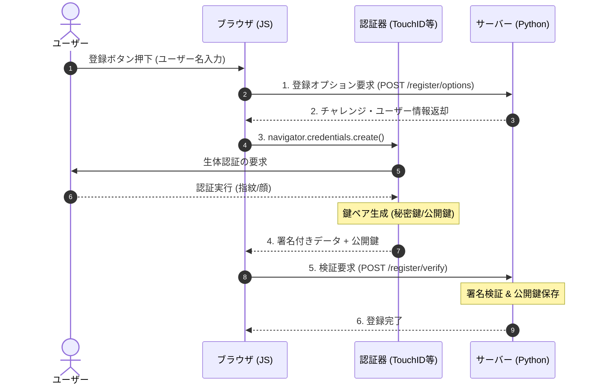
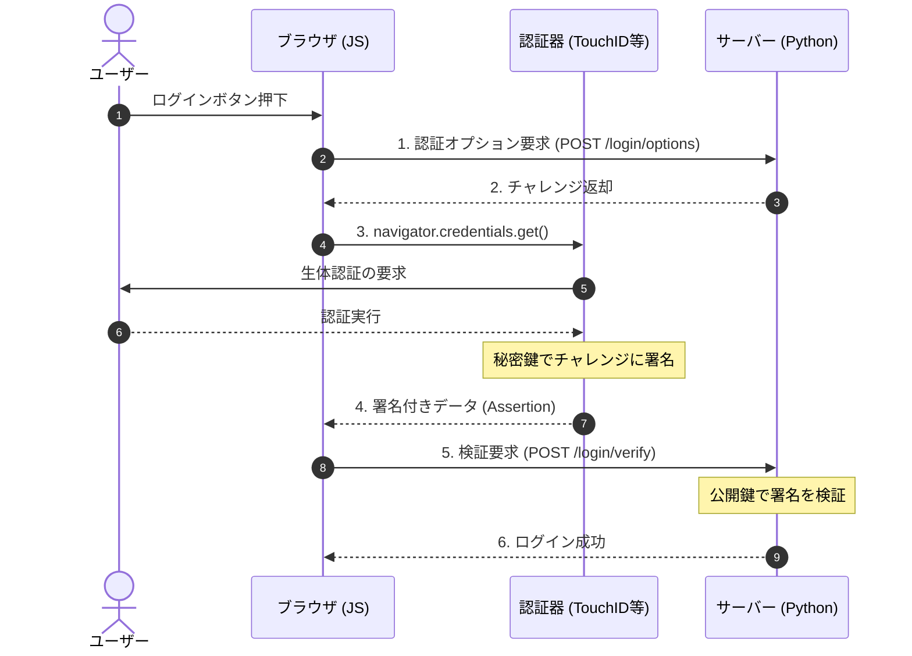

# パスキー認証の概論と実装ハンズオン (Python版)

## **はじめに**

このテキストは、次世代の認証規格である「パスキー（Passkey）」の仕組みを理解し、Python（Flask）を用いて実際にサーバーサイドとクライアントサイドの実装を行うための演習資料です。

前半の「概論パート」で基礎理論を学び、後半の「実践パート」で実際にコードを書いて認証システムを構築します。

# **第1部：【概論】パスキーと次世代認証の仕組み**

## **第1章：なぜ「パスワード」はなくすべきなのか？**

### **1.1 パスワード認証が抱える構造的な欠陥**

従来の「ID + パスワード」による認証は、インターネット黎明期から使われてきましたが、現在は限界を迎えています。

* **人間にとっての限界:**  
  * **記憶の限界:** サービスごとに異なる複雑なパスワードを覚えるのは不可能。  
  * **使い回しの横行:** 結果として「同じパスワード」を複数のサイトで使い回してしまう。  
* **セキュリティの限界:**  
  * **リスト型攻撃:** 1つのサイトから漏洩したID/PWを使って、他のサイトへ不正ログインされる。  
  * **フィッシング詐欺:** 本物そっくりの偽サイトに誘導され、ユーザー自らがパスワードを入力して盗まれてしまう。

### **1.2 多要素認証（MFA）とその課題**

パスワードを補うために、SMS認証やアプリ（Google Authenticatorなど）によるワンタイムパスワード（OTP）が普及しました。しかし、これらも**「フィッシング」には無力**です。偽サイトにOTPを入力してしまえば、攻撃者はそれをリアルタイムに使ってログインできてしまうからです。

## **第2章：FIDO（ファイド）とパスキー**

### **2.1 FIDOアライアンスとFIDO2**

この問題を解決するために発足したのが、Google、Apple、Microsoftなどが参加する標準化団体「FIDO Alliance」です。  
現在主流の規格であるFIDO2は、以下の2つの技術要素で構成されています。

1. **WebAuthn (Web Authentication API):**  
   * WebブラウザとWebサーバー（今回のPythonアプリ）との間の通信規格。W3C標準。  
2. **CTAP (Client to Authenticator Protocol):**  
   * PC/スマホ（クライアント）と、認証器（外部セキュリティキーやスマホ内蔵の生体認証）との間の通信規格。

### **2.2 公開鍵暗号方式による認証の仕組み**

パスキーの核心は、**「パスワード（共有秘密）」を使わず、「公開鍵暗号」を使う**点にあります。

* **登録時:**  
  * デバイス（スマホ等）の中で「鍵ペア（秘密鍵と公開鍵）」を生成する。  
  * **公開鍵**だけをサーバーに送って登録する。  
  * **秘密鍵**はデバイスから一歩も外に出ない（厳重に保管される）。  


【解説】

1. 登録オプション要求: クライアント（JS）は「ユーザーXXXとして登録したい」とサーバーにリクエストします。

1. チャレンジ生成: サーバーは、リプレイ攻撃（通信内容を盗聴して再利用する攻撃）を防ぐため、ランダムな文字列「チャレンジ」を生成し、一時保存してからクライアントへ送ります。

1. 認証器の起動: ブラウザは navigator.credentials.create() を呼び出し、PCやスマホの認証器を起動します。

1. 鍵ペア生成: ユーザーが指紋などで承認すると、認証器内部で「秘密鍵」と「公開鍵」のペアが作られます。秘密鍵はデバイス内に安全に保存されます。

1. 署名と送信: 認証器は「チャレンジ」などのデータに対して署名を行い、「公開鍵」と共にサーバーへ送ります。

1. 検証と保存: サーバーは、送られてきた署名が正しいか、チャレンジが一致するかを検証します。問題なければ、「公開鍵」と「Credential ID」をデータベースに保存します。

* **認証時（ログイン時）:**  
  * サーバー：「このデータを秘密鍵で署名してくれ（チャレンジ）」  
  * デバイス：「生体認証OKなら署名して返すよ」→ 署名を作成して返送。  
  * サーバー：「登録されている公開鍵で署名を検証」→ 成功ならログイン許可。

【解説】

1. 認証オプション要求: クライアント（JS）は「ログインしたい」とサーバーにリクエストします。

1. チャレンジ返却: サーバーは再びランダムな「チャレンジ」を生成して送ります。このとき、登録済みの「Credential ID」のリストも一緒に送り、「このIDの鍵を持っていますか？」と問い合わせることもあります（allowCredentials）。

1. 認証器の起動: ブラウザは navigator.credentials.get() を呼び出します。

1. 署名作成: 認証器は、保存されている「秘密鍵」を使って、サーバーから送られた「チャレンジ」に署名します。これは「私は秘密鍵を持っています」という暗号的な証明になります。

1. 署名送信: 作成された署名データ（Assertion）をサーバーへ送ります。

1. 署名検証: サーバーは、データベースに保存してある「公開鍵」を使って署名を検証します。署名が正しければ、秘密鍵を持っている本人であると証明され、ログインが成功します。

★最大のメリット：  
サーバーには「公開鍵」しかないため、サーバーがハッキングされて情報が漏洩しても、攻撃者は何もできません（公開鍵ではログインできないため）。また、偽サイト（フィッシングサイト）では署名が作れないため、フィッシングを完全に防ぐことができます。

### **2.3 重要な用語と概念**

実装の前に、FIDO/WebAuthnで使用される重要な用語を整理します。
- User Verification (ユーザー検証):
    - PIN入力や生体認証（指紋・顔）を行い、「登録された本人であること」を確認するプロセス。単なるタッチ（User Presence）よりも強力な確認手段です。

- Attestation (構成証明):
    - 登録時に認証器から送られる「認証器の製造元やモデル情報」を含む署名データ。サーバーはこれを検証することで、「会社支給のYubiKeyのみ許可する」といった制御が可能になります。

- Sign Count (署名カウンター):
    - 認証器が認証を行うたびにインクリメントされる数値。サーバー側で前回の値と比較することで、 認証器の不正な複製（クローン）を検知するために使用されます。

- Authenticator (認証器) の種類:    
    - Platform Authenticator: PCやスマホに内蔵された認証器（Touch ID, Windows Helloなど）。
    - Roaming Authenticator: 持ち運び可能な外部認証器（YubiKeyなどのUSBキー）。

# **第2部：【実践】WebAuthn実装ハンズオン**

ここからは、実際にPythonを使ってパスキー認証システムを構築します。

## **第3章：開発環境の準備**

本ハンズオンでは、軽量なWebフレームワークであるFlaskと、WebAuthn処理用ライブラリwebauthnを使用します。

### **3.1 アーキテクチャと登場人物（新規追加）**
システムを構成する3つの要素を理解しましょう。

- Relying Party (RP):

    - 認証を利用する**Webアプリケーション（サーバー）**のこと。今回はPythonで実装します。

- RP ID: 
  - サービスのドメイン名（例: localhost, example.com）。認証のスコープを決定します。

- Client (User Agent):
    - Webブラウザのこと。JavaScriptを実行し、WebAuthn API (navigator.credentials) を呼び出してRPと認証器の仲介を行います。

- Authenticator:
    - 認証器。秘密鍵を管理し、ユーザーの生体認証等を経て署名を作成します。


### **3.2 必要なライブラリのインストール**

ターミナル（コマンドプロンプト）を開き、以下のコマンドを実行してください。  
※ Windows環境でのエラーを防ぐため、cffi も同時にインストールします。  
```
pip install flask webauthn cffi
```

### **3.3 プロジェクト構成**

作業フォルダを作成し、以下のファイル構成にしてください。

passkey_project/  
├── app.py           # サーバーサイド（Python）  
├── static/  
│   └── script.js    # クライアントサイド（JavaScript）  
└── templates/  
    └── index.html   # 画面（HTML）

## **第4章：サーバーサイドの実装（app.py）**

webauthn ライブラリのバージョンアップに伴い、JSON変換には options_to_json ヘルパー関数を使用します。また、クライアント側でエラー原因がわかりやすいよう、適切なエラーハンドリングを実装します。

**app.py の作成:**
```python
from flask import Flask, render_template, request, jsonify, session, Response  
from webauthn import (  
    generate_registration_options,  
    verify_registration_response,  
    generate_authentication_options,  
    verify_authentication_response,  
)  
# JSON変換用のヘルパー関数をインポート  
from webauthn.helpers import bytes_to_base64url, base64url_to_bytes, options_to_json  
from webauthn.helpers.structs import (  
    AuthenticatorSelectionCriteria,  
    UserVerificationRequirement,  
    AuthenticatorAttachment,  
)  
import os

app = Flask(__name__)  
app.secret_key = os.urandom(32)  # セッション用の秘密鍵

# --- 簡易データベース（本来はDBを使用） ---  
# ユーザー情報: { "username": UserObject }  
users_db = {}  
# ユーザーごとの認証器（公開鍵）リスト: { "username": [CredentialObject, ...] }  
credentials_db = {}

# RP（サービス提供者）の設定  
RP_ID = "localhost"  
RP_NAME = "Passkey Hands-on Class"  
ORIGIN = "http://localhost:5000"

@app.route('/')  
def index():  
    return render_template('index.html')

@app.route('/register/options', methods=['POST'])  
def register_options():  
    try:  
        username = request.json.get('username')  
        if not username:  
             return jsonify({"status": "failed", "message": "ユーザー名が必要です"}), 400  
          
        # ユーザーが存在しない場合は作成（簡易実装）  
        if username not in users_db:  
            users_db[username] = {  
                "id": os.urandom(32), # 一意なバイト列ID  
                "name": username,  
                "display_name": username  
            }  
          
        user = users_db[username]

        # WebAuthnの登録オプション生成  
        options = generate_registration_options(  
            rp_id=RP_ID,  
            rp_name=RP_NAME,  
            user_id=user["id"],  
            user_name=user["name"],  
            authenticator_selection=AuthenticatorSelectionCriteria(  
                user_verification=UserVerificationRequirement.PREFERRED,  
                authenticator_attachment=AuthenticatorAttachment.PLATFORM # 指紋認証など内蔵器を利用  
            )  
        )

        # 検証用にチャレンジをセッションに保存  
        session['challenge'] = bytes_to_base64url(options.challenge)  
          
        # JSON化してクライアントへ（Content-Typeを明示）  
        return Response(options_to_json(options), mimetype='application/json')  
          
    except Exception as e:  
        print(f"Error in register_options: {e}")  
        return jsonify({"status": "error", "message": str(e)}), 500

@app.route('/register/verify', methods=['POST'])  
def register_verify():  
    try:  
        username = request.json.get('username')  
        challenge = session.get('challenge')  
          
        # 署名の検証  
        verification = verify_registration_response(  
            credential=request.json,  
            expected_challenge=base64url_to_bytes(challenge),  
            expected_origin=ORIGIN,  
            expected_rp_id=RP_ID,  
        )  
          
        # 検証成功！公開鍵などを保存  
        if username not in credentials_db:  
            credentials_db[username] = []  
              
        credentials_db[username].append(verification.credential_id)  
        # ※本来は verification.credential_public_key もDBに保存します  
        print(f"Registered Credential ID: {verification.credential_id}")  
          
        return jsonify({"status": "ok", "message": "登録完了！"})  
          
    except Exception as e:  
        print(f"Error in register_verify: {e}")  
        return jsonify({"status": "failed", "message": str(e)}), 400

@app.route('/login/options', methods=['POST'])  
def login_options():  
    try:  
        username = request.json.get('username')  
          
        options = generate_authentication_options(  
            rp_id=RP_ID,  
            user_verification=UserVerificationRequirement.PREFERRED,  
        )  
          
        session['challenge'] = bytes_to_base64url(options.challenge)  
        session['login_user'] = username   
          
        return Response(options_to_json(options), mimetype='application/json')

    except Exception as e:  
        print(f"Error in login_options: {e}")  
        return jsonify({"status": "error", "message": str(e)}), 500

@app.route('/login/verify', methods=['POST'])  
def login_verify():  
    try:  
        challenge = session.get('challenge')  
        username = session.get('login_user')

        # 署名の検証  
        # 注意: 本来はDBから取得した公開鍵を credential_public_key に渡す必要があります  
        verification = verify_authentication_response(  
            credential=request.json,  
            expected_challenge=base64url_to_bytes(challenge),  
            expected_origin=ORIGIN,  
            expected_rp_id=RP_ID,  
            credential_public_key=b'', # ★ここが空だと厳密な署名検証はできませんが、フローの確認は可能です  
            credential_current_sign_count=0,  
        )  
          
        return jsonify({"status": "ok", "message": f"ログイン成功！ようこそ {username} さん"})  
          
    except Exception as e:  
        print(f"Validation Error: {e}")  
        # 公開鍵がないためエラーになりますが、ハンズオン進行のためメッセージを調整  
        return jsonify({"status": "failed", "message": f"検証エラー: {str(e)}（※DB連携未実装のため想定内です）"}), 400

if __name__ == '__main__':  
    app.run(debug=True, port=5000)
```

## **第5章：クライアントサイドの実装 (HTML/JS)**

ライブラリの読み込みトラブルを避けるため、最新のJavaScript標準機能（ES Modules）を使用します。

**templates/index.html** の作成:  
キャッシュ対策として、JSファイル読み込み時に ?v=2 を付与しています。  
```html
<!DOCTYPE html>  
<html lang="ja">  
<head>  
    <meta charset="UTF-8">  
    <title>Passkey Hands-on</title>  
</head>  
<body>  
    <h1>パスキー ハンズオン v2</h1>  
      
    <div>  
        <h2>1. 登録</h2>  
        <input type="text" id="username" placeholder="ユーザー名">  
        <button onclick="register()">パスキーを登録</button>  
    </div>

    <div>  
        <h2>2. 認証（ログイン）</h2>  
        <button onclick="login()">パスキーでログイン</button>  
    </div>

    <!-- type="module" を指定し、キャッシュ対策のクエリパラメータを付与 -->  
    <script type="module" src="/static/script.js?v=2"></script>  
</body>  
</html>
```

**static/script.js** の作成:  
GitHub製のライブラリ webauthn-json をESM形式でインポートします。  

```JavaScript
// ライブラリを直接インポート（ESM形式）  
// 構文エラーの原因となるMarkdown記法は含めないでください  
import { create, get, parseCreationOptionsFromJSON, parseRequestOptionsFromJSON } from 'https://cdn.jsdelivr.net/npm/@github/webauthn-json@2.1.1/dist/esm/webauthn-json.browser-ponyfill.js';

// デバッグ用ログ  
console.log("Script loaded: v2 (Integrated Version)");

async function register() {  
    const username = document.getElementById('username').value;  
    if (!username) return alert("ユーザー名を入力してください");

    try {  
        console.log("Registering...");  
        // 1. サーバーからオプション取得  
        const resp = await fetch('/register/options', {  
            method: 'POST',  
            headers: { 'Content-Type': 'application/json' },  
            body: JSON.stringify({ username })  
        });  
        const options = await resp.json();

        if (options.status === 'failed' || options.status === 'error') {  
             throw new Error(options.message);  
        }

        // 2. ブラウザのAPIを呼び出し  
        // 重要: サーバーからのoptionsを { publicKey: options } の形にラップして渡します  
        const credential = await create(parseCreationOptionsFromJSON({ publicKey: options }));  
        console.log("Credential created:", credential);

        // 3. 署名をサーバーへ送信して検証  
        const verifyResp = await fetch('/register/verify', {  
            method: 'POST',  
            headers: { 'Content-Type': 'application/json' },  
            body: JSON.stringify({   
                username: username,  
                ...credential.toJSON()   
            })  
        });  
          
        const result = await verifyResp.json();  
        alert(result.message);

    } catch (err) {  
        console.error(err);  
        alert("登録エラー: " + err.message);  
    }  
}

async function login() {  
    const username = document.getElementById('username').value;  
      
    try {  
        console.log("Logging in...");  
        // 1. サーバーからオプション取得  
        const resp = await fetch('/login/options', {  
            method: 'POST',  
            headers: { 'Content-Type': 'application/json' },  
            body: JSON.stringify({ username })  
        });  
        const options = await resp.json();  
          
        if (options.status === 'failed' || options.status === 'error') {  
             throw new Error(options.message);  
        }

        // 2. ブラウザのAPI呼び出し  
        // 重要: こちらも同様にラップします  
        const credential = await get(parseRequestOptionsFromJSON({ publicKey: options }));

        // 3. サーバーへ送信  
        const verifyResp = await fetch('/login/verify', {  
            method: 'POST',  
            headers: { 'Content-Type': 'application/json' },  
            body: JSON.stringify(credential.toJSON())  
        });  
          
        const result = await verifyResp.json();  
        alert(result.message);

    } catch (err) {  
        console.error(err);  
        alert("ログインエラー: " + err.message);  
    }  
}

// type="module" の場合、関数はスコープ内に閉じ込められるため、  
// HTMLのボタンから呼び出せるように window オブジェクトに明示的に登録します  
window.register = register;  
window.login = login;
```

## **第6章：実行と確認**

1. サーバー起動:  
   ターミナルで python app.py を実行します。  
   (※ 前回のプロセスが残っている場合は、一度 Ctrl+C で停止してから再実行してください)  
2. ブラウザでアクセス:  
   Chromeなどで *http://localhost:5000* にアクセスします。  
   画面に「パスキー ハンズオン v2」と表示されていることを確認してください。  
3. 動作確認:  
   開発者ツール（F12）のコンソールを開き、Script loaded: v2 (Integrated Version) と表示されていれば準備完了です。ユーザー名を入力して「パスキーを登録」ボタンを押してください。

## **まとめ**

本ハンズオンでは、WebAuthnの仕様に基づいた認証フローを実装しました。  
特にライブラリのバージョンや環境による差異（JSON変換の方法や、ブラウザでのモジュール読み込み）は、実開発でも躓きやすいポイントです。この v2 コードをベースに、さらにデータベース連携などの発展課題に取り組んでみてください。