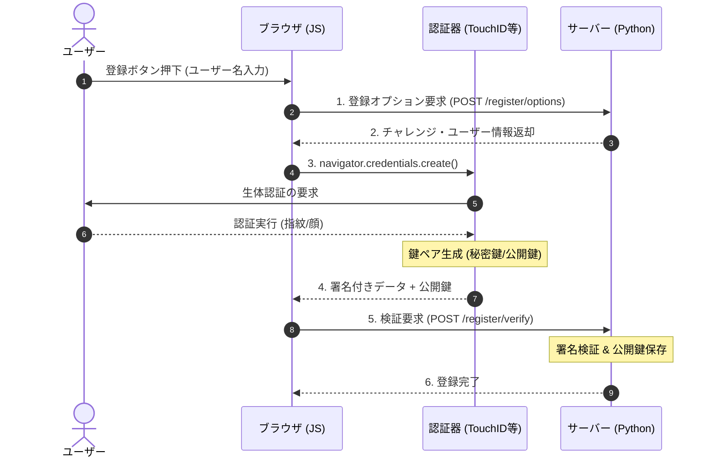
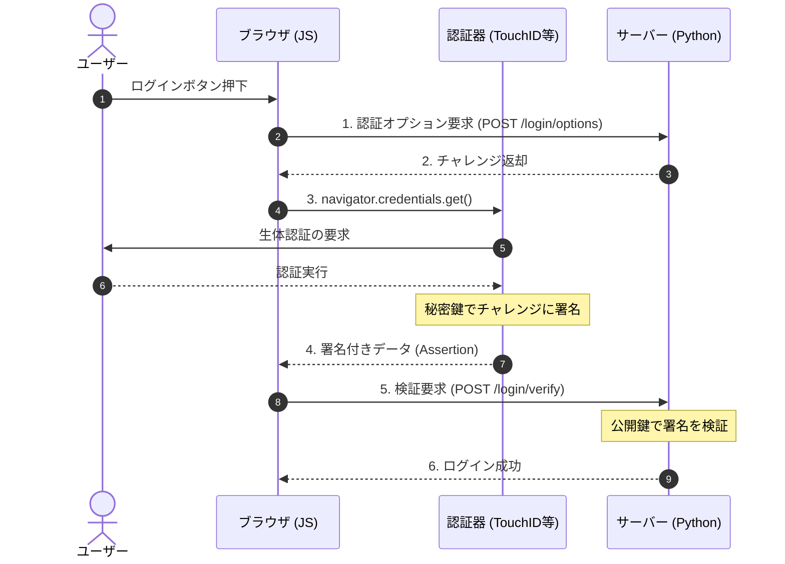

# パスキー認証の概論と実装ハンズオン (Python版)

## **はじめに**

このテキストは、次世代の認証規格である「パスキー（Passkey）」の仕組みを理解し、Python（Flask）を用いて実際にサーバーサイドとクライアントサイドの実装を行うための演習資料です。

前半の「概論パート」で基礎理論を学び、後半の「実践パート」で実際にコードを書いて認証システムを構築します。

# **第1部：【概論】パスキーと次世代認証の仕組み**

## **第1章：なぜ「パスワード」はなくすべきなのか？**

### **1.1 パスワード認証が抱える構造的な欠陥**

従来の「ID + パスワード」による認証は、インターネット黎明期から使われてきましたが、現在は限界を迎えています。

* **人間にとっての限界:**  
  * **記憶の限界:** サービスごとに異なる複雑なパスワードを覚えるのは不可能。  
  * **使い回しの横行:** 結果として「同じパスワード」を複数のサイトで使い回してしまう。  
* **セキュリティの限界:**  
  * **リスト型攻撃:** 1つのサイトから漏洩したID/PWを使って、他のサイトへ不正ログインされる。  
  * **フィッシング詐欺:** 本物そっくりの偽サイトに誘導され、ユーザー自らがパスワードを入力して盗まれてしまう。

### **1.2 多要素認証（MFA）とその課題**

パスワードを補うために、SMS認証やアプリ（Google Authenticatorなど）によるワンタイムパスワード（OTP）が普及しました。しかし、これらも**「フィッシング」には無力**です。偽サイトにOTPを入力してしまえば、攻撃者はそれをリアルタイムに使ってログインできてしまうからです。

## **第2章：FIDO（ファイド）とパスキー**

### **2.1 FIDOアライアンスとFIDO2**

この問題を解決するために発足したのが、Google、Apple、Microsoftなどが参加する標準化団体「FIDO Alliance」です。  
現在主流の規格であるFIDO2は、以下の2つの技術要素で構成されています。

1. **WebAuthn (Web Authentication API):**  
   * WebブラウザとWebサーバー（今回のPythonアプリ）との間の通信規格。W3C標準。  
2. **CTAP (Client to Authenticator Protocol):**  
   * PC/スマホ（クライアント）と、認証器（外部セキュリティキーやスマホ内蔵の生体認証）との間の通信規格。

### **2.2 公開鍵暗号方式による認証の仕組み**

パスキーの核心は、**「パスワード（共有秘密）」を使わず、「公開鍵暗号」を使う**点にあります。

* **登録時:**  
  * デバイス（スマホ等）の中で「鍵ペア（秘密鍵と公開鍵）」を生成する。  
  * **公開鍵**だけをサーバーに送って登録する。  
  * **秘密鍵**はデバイスから一歩も外に出ない（厳重に保管される）。  


```mermaid
sequenceDiagram
    autonumber
    actor User as ユーザー
    participant Client as ブラウザ (JS)
    participant Auth as 認証器 (TouchID等)
    participant Server as サーバー (Python)

    User->>Client: 登録ボタン押下 (ユーザー名入力)
    Client->>Server: 1. 登録オプション要求 (POST /register/options)
    Server-->>Client: 2. チャレンジ・ユーザー情報返却
    Client->>Auth: 3. navigator.credentials.create()
    Auth->>User: 生体認証の要求
    User-->>Auth: 認証実行 (指紋/顔)
    Note over Auth: 鍵ペア生成 (秘密鍵/公開鍵)
    Auth-->>Client: 4. 署名付きデータ + 公開鍵
    Client->>Server: 5. 検証要求 (POST /register/verify)
    Note over Server: 署名検証 & 公開鍵保存
    Server-->>Client: 6. 登録完了

```
【解説】

1. 登録オプション要求: クライアント（JS）は「ユーザーXXXとして登録したい」とサーバーにリクエストします。

1. チャレンジ生成: サーバーは、リプレイ攻撃（通信内容を盗聴して再利用する攻撃）を防ぐため、ランダムな文字列「チャレンジ」を生成し、一時保存してからクライアントへ送ります。

1. 認証器の起動: ブラウザは navigator.credentials.create() を呼び出し、PCやスマホの認証器を起動します。

1. 鍵ペア生成: ユーザーが指紋などで承認すると、認証器内部で「秘密鍵」と「公開鍵」のペアが作られます。秘密鍵はデバイス内に安全に保存されます。

1. 署名と送信: 認証器は「チャレンジ」などのデータに対して署名を行い、「公開鍵」と共にサーバーへ送ります。

1. 検証と保存: サーバーは、送られてきた署名が正しいか、チャレンジが一致するかを検証します。問題なければ、「公開鍵」と「Credential ID」をデータベースに保存します。

* **認証時（ログイン時）:**  
  * サーバー：「このデータを秘密鍵で署名してくれ（チャレンジ）」  
  * デバイス：「生体認証OKなら署名して返すよ」→ 署名を作成して返送。  
  * サーバー：「登録されている公開鍵で署名を検証」→ 成功ならログイン許可。

```mermaid
sequenceDiagram
    autonumber
    actor User as ユーザー
    participant Client as ブラウザ (JS)
    participant Auth as 認証器 (TouchID等)
    participant Server as サーバー (Python)

    User->>Client: ログインボタン押下
    Client->>Server: 1. 認証オプション要求 (POST /login/options)
    Server-->>Client: 2. チャレンジ返却
    Client->>Auth: 3. navigator.credentials.get()
    Auth->>User: 生体認証の要求
    User-->>Auth: 認証実行
    Note over Auth: 秘密鍵でチャレンジに署名
    Auth-->>Client: 4. 署名付きデータ (Assertion)
    Client->>Server: 5. 検証要求 (POST /login/verify)
    Note over Server: 公開鍵で署名を検証
    Server-->>Client: 6. ログイン成功

```
【解説】

1. 認証オプション要求: クライアント（JS）は「ログインしたい」とサーバーにリクエストします。

1. チャレンジ返却: サーバーは再びランダムな「チャレンジ」を生成して送ります。このとき、登録済みの「Credential ID」のリストも一緒に送り、「このIDの鍵を持っていますか？」と問い合わせることもあります（allowCredentials）。

1. 認証器の起動: ブラウザは navigator.credentials.get() を呼び出します。

1. 署名作成: 認証器は、保存されている「秘密鍵」を使って、サーバーから送られた「チャレンジ」に署名します。これは「私は秘密鍵を持っています」という暗号的な証明になります。

1. 署名送信: 作成された署名データ（Assertion）をサーバーへ送ります。

1. 署名検証: サーバーは、データベースに保存してある「公開鍵」を使って署名を検証します。署名が正しければ、秘密鍵を持っている本人であると証明され、ログインが成功します。

★最大のメリット：  
サーバーには「公開鍵」しかないため、サーバーがハッキングされて情報が漏洩しても、攻撃者は何もできません（公開鍵ではログインできないため）。また、偽サイト（フィッシングサイト）では署名が作れないため、フィッシングを完全に防ぐことができます。

### **2.3 重要な用語と概念**

実装の前に、FIDO/WebAuthnで使用される重要な用語を整理します。
- User Verification (ユーザー検証):
    - PIN入力や生体認証（指紋・顔）を行い、「登録された本人であること」を確認するプロセス。単なるタッチ（User Presence）よりも強力な確認手段です。

- Attestation (構成証明):
    - 登録時に認証器から送られる「認証器の製造元やモデル情報」を含む署名データ。サーバーはこれを検証することで、「会社支給のYubiKeyのみ許可する」といった制御が可能になります。

- Sign Count (署名カウンター):
    - 認証器が認証を行うたびにインクリメントされる数値。サーバー側で前回の値と比較することで、 認証器の不正な複製（クローン）を検知するために使用されます。

- Authenticator (認証器) の種類:    
    - Platform Authenticator: PCやスマホに内蔵された認証器（Touch ID, Windows Helloなど）。
    - Roaming Authenticator: 持ち運び可能な外部認証器（YubiKeyなどのUSBキー）。

# **第2部：【実践】WebAuthn実装ハンズオン**

ここからは、実際にPythonを使ってパスキー認証システムを構築します。

## **第3章：開発環境の準備**

本ハンズオンでは、軽量なWebフレームワークであるFlaskと、WebAuthn処理用ライブラリwebauthnを使用します。

### **3.1 アーキテクチャと登場人物（新規追加）**
システムを構成する3つの要素を理解しましょう。

- Relying Party (RP):

    - 認証を利用する**Webアプリケーション（サーバー）**のこと。今回はPythonで実装します。

- RP ID: 
  - サービスのドメイン名（例: localhost, example.com）。認証のスコープを決定します。

- Client (User Agent):
    - Webブラウザのこと。JavaScriptを実行し、WebAuthn API (navigator.credentials) を呼び出してRPと認証器の仲介を行います。

- Authenticator:
    - 認証器。秘密鍵を管理し、ユーザーの生体認証等を経て署名を作成します。


### **3.2 必要なライブラリのインストール**

ターミナル（コマンドプロンプト）を開き、以下のコマンドを実行してください。  
※ Windows環境でのエラーを防ぐため、cffi も同時にインストールします。  
```
pip install flask webauthn cffi
```

### **3.3 プロジェクト構成**

作業フォルダを作成し、以下のファイル構成にしてください。

passkey_project/  
├── app.py           # サーバーサイド（Python）  
├── static/  
│   └── script.js    # クライアントサイド（JavaScript）  
└── templates/  
    └── index.html   # 画面（HTML）

## **第4章：サーバーサイドの実装（app.py）**

webauthn ライブラリのバージョンアップに伴い、JSON変換には options_to_json ヘルパー関数を使用します。また、クライアント側でエラー原因がわかりやすいよう、適切なエラーハンドリングを実装します。

**app.py の作成:**
```python
"""
PassKey (WebAuthn) ハンズオン - サーバーサイド実装
"""

from flask import Flask, render_template, request, jsonify, session, Response
from webauthn import (
    generate_registration_options,
    verify_registration_response,
    generate_authentication_options,
    verify_authentication_response,
)
from webauthn.helpers import bytes_to_base64url, base64url_to_bytes, options_to_json
from webauthn.helpers.structs import (
    AuthenticatorSelectionCriteria,
    UserVerificationRequirement,
)
import os
import sqlite3

# ============================================================
# Flask アプリケーション初期化
# ============================================================
app = Flask(__name__)
# セッションデータの改ざん防止用の秘密鍵（32バイトのランダム値）
# 本番環境では固定値を使用すること（再起動でセッションが切れないように）
app.secret_key = os.urandom(32)

# ============================================================
# Relying Party (RP) 設定
# ============================================================
# RP_ID: サービスの一意な識別子（ドメイン名）
#   - 登録時とログイン時で一致している必要がある
#   - localhost開発時は "localhost" を使用
#   - 本番環境では "example.com" のようなドメインを指定
RP_ID = "localhost"

# RP_NAME: ユーザーに表示されるサービス名
#   - 認証器の登録画面で「example.comにPassKeyを登録しますか？」のように表示される
RP_NAME = "Passkey Hands-on Class"

# ORIGIN: サーバーのオリジン（プロトコル + ドメイン + ポート）
#   - 暗号器が生成するclientDataJSON内のoriginと一致する必要がある
#   - 開発時は http、本番環境では https が必須
ORIGIN = "http://localhost:5000"

# ALLOWED_ORIGINS: 許可するオリジンのリスト
#   - localhostと127.0.0.1の両方に対応するためリストで指定
#   - 検証時に暗号器から送られてきたoriginがこのリストに含まれているかチェック
ALLOWED_ORIGINS = ["http://localhost:5000", "http://127.0.0.1:5000"]

# ============================================================
# SQLite データベース設定
# ============================================================
# PassKeyでは以下の情報を永続的に保存する必要がある:
#   1. ユーザー情報（ユーザー名、表示名、一意なID）
#   2. 認証器情報（credential_id、公開鍵、署名カウンター）
#
# 重要: 秘密鍵は暗号器内にのみ保存され、サーバーには保存されない
#       サーバーが持つのは公開鍵のみ（これによりサーバー漏洩時も安全）
DB_PATH = "passkey.db"


def get_db():
    """
    SQLiteデータベースへの接続を取得するヘルパー関数

    row_factory=sqlite3.Row を設定することで、
    結果を辞書のように cur["カラム名"] でアクセス可能にする
    """
    conn = sqlite3.connect(DB_PATH)
    conn.row_factory = sqlite3.Row
    return conn


def init_db():
    """
    データベースの初期化（テーブル作成）
    """
    conn = get_db()
    cur = conn.cursor()

    cur.execute("""
        CREATE TABLE IF NOT EXISTS users (
            id TEXT PRIMARY KEY,
            name TEXT UNIQUE NOT NULL,
            display_name TEXT
        )
    """)

    cur.execute("""
        CREATE TABLE IF NOT EXISTS credentials (
            id TEXT PRIMARY KEY,
            user_id TEXT NOT NULL,
            public_key BLOB NOT NULL,
            sign_count INTEGER DEFAULT 0,
            FOREIGN KEY (user_id) REFERENCES users(id)
        )
    """)

    conn.commit()
    conn.close()


# アプリケーション起動時にデータベースを初期化
init_db()


# ============================================================
# ルート: トップページ
# ============================================================
@app.route('/')
def index():
    """
    HTMLテンプレートを返す
    登録・ログインのUIを提供
    """
    return render_template('index.html')


# ============================================================
# 登録フロー ステップ1: 登録オプションの生成
# ============================================================
@app.route('/register/options', methods=['POST'])
def register_options():
    try:
        # クライアントからユーザー名を取得
        username = request.json.get('username')
        if not username:
            return jsonify({"status": "failed", "message": "ユーザー名が必要です"}), 400

        # --- ユーザー情報の管理 ---
        # 新規ユーザーの場合はデータベースに作成
        # 既存ユーザーの場合は既存の情報を取得
        conn = get_db()
        cur = conn.cursor()

        cur.execute("SELECT * FROM users WHERE name = ?", (username,))
        user = cur.fetchone()

        if not user:
            # 新規ユーザー作成
            # user_id: 32バイトのランダム値をBase64URL形式に変換
            #   - 暗号器に渡すユーザー識別子
            #   - 推測不可能な値である必要がある
            user_id = bytes_to_base64url(os.urandom(32))
            cur.execute(
                "INSERT INTO users (id, name, display_name) VALUES (?, ?, ?)",
                (user_id, username, username)
            )
            conn.commit()

            # 作成したユーザー情報を再取得
            cur.execute("SELECT * FROM users WHERE name = ?", (username,))
            user = cur.fetchone()

        conn.close()

        # --- WebAuthn登録オプションの生成 ---
        # このオプションがブラウザ→暗号器に渡され、鍵生成の指示となる
        options = generate_registration_options(
            rp_id=RP_ID,           # サービスの識別子（ドメイン）
            rp_name=RP_NAME,       # サービスの表示名
            user_id=base64url_to_bytes(user["id"]),  # ユーザーの一意なID（バイト列に変換）
            user_name=user["name"],                  # ユーザー名
            authenticator_selection=AuthenticatorSelectionCriteria(
                # user_verification: ユーザー確認（指紋・顔認証など）の要求レベル
                #   PREFERRED: 対応していれば使用する（デフォルト推奨）
                #   REQUIRED: 必須（対応していない認証器は使用不可）
                #   DISCOURAGED: 使用しない（PINのみなど）
                user_verification=UserVerificationRequirement.PREFERRED
            )
        )

        # challengeをセッションに保存
        # 次のリクエスト（/register/verify）で検証に使用する
        # bytes_to_base64url: バイト列をURLセーフなBase64文字列に変換
        session['challenge'] = bytes_to_base64url(options.challenge)

        # オプションをJSON形式でクライアントに返す
        # クライアントはこのJSONを navigator.credentials.create() に渡す
        return Response(options_to_json(options), mimetype='application/json')

    except Exception as e:
        print(f"Error in register_options: {e}")
        return jsonify({"status": "error", "message": str(e)}), 500


# ============================================================
# 登録フロー ステップ2: 登録レスポンスの検証と保存
# ============================================================
@app.route('/register/verify', methods=['POST'])
def register_verify():
    try:
        # クライアントからユーザー名と認証データを受信
        username = request.json.get('username')
        # 登録時にセッションに保存したchallengeを取得
        challenge = session.get('challenge')

        if not username or not challenge:
            return jsonify({"status": "failed", "message": "セッションエラー"}), 400

        # --- 登録レスポンスの検証 ---
        # webauthnライブラリが以下の検証を自動で行う:
        #   1. clientDataJSONの解析とchallenge一致確認
        #   2. originの一致確認（ALLOWED_ORIGINSリストと照合）
        #   3. rp_id_hashの一致確認
        #   4. attestationObjectの解析と署名検証
        #   5. ユーザープレゼンス（UP）フラグの確認
        verification = verify_registration_response(
            credential=request.json,                        # クライアントから送信された認証データ
            expected_challenge=base64url_to_bytes(challenge),  # 期待するchallenge（バイト列に変換）
            expected_origin=ALLOWED_ORIGINS,                # 許可するオリジンのリスト
            expected_rp_id=RP_ID,                           # 期待するrp_id
        )

        # --- 公開鍵の保存 ---
        # 検証に成功したら、暗号器から送られてきた公開鍵をデータベースに保存
        # この公開鍵は後のログイン時の署名検証に使用される
        conn = get_db()
        cur = conn.cursor()

        # ユーザーIDを取得
        cur.execute("SELECT id FROM users WHERE name = ?", (username,))
        user = cur.fetchone()
        if not user:
            conn.close()
            return jsonify({"status": "failed", "message": "ユーザーが見つかりません"}), 400

        # 認証器情報をデータベースに保存
        # verification.credential_id: 認証器の一意な識別子
        # verification.credential_public_key: 公開鍵（COSE形式のバイナリ）
        # verification.sign_count: 署名カウンター（初期値）
        cur.execute("""
            INSERT INTO credentials (id, user_id, public_key, sign_count)
            VALUES (?, ?, ?, ?)
        """, (
            bytes_to_base64url(verification.credential_id),  # credential_idをBase64URLに変換して保存
            user["id"],                                       # ユーザーID
            verification.credential_public_key,              # 公開鍵（バイナリそのまま保存）
            verification.sign_count                          # 署名カウンター
        ))
        conn.commit()
        conn.close()

        print(f"Registered Credential ID: {bytes_to_base64url(verification.credential_id)}")

        return jsonify({"status": "ok", "message": "登録完了！"})

    except Exception as e:
        print(f"Error in register_verify: {e}")
        return jsonify({"status": "failed", "message": str(e)}), 400


# ============================================================
# 認証フロー ステップ1: 認証オプションの生成
# ============================================================
@app.route('/login/options', methods=['POST'])
def login_options():
    try:
        username = request.json.get('username')
        if not username:
            return jsonify({"status": "failed", "message": "ユーザー名が必要です"}), 400

        # ユーザーの存在確認
        # 存在しないユーザーではログインできない
        conn = get_db()
        cur = conn.cursor()
        cur.execute("SELECT id FROM users WHERE name = ?", (username,))
        user = cur.fetchone()
        conn.close()

        if not user:
            return jsonify({"status": "failed", "message": "ユーザーが見つかりません"}), 400

        # --- WebAuthn認証オプションの生成 ---
        options = generate_authentication_options(
            rp_id=RP_ID,           # サービスの識別子
            user_verification=UserVerificationRequirement.PREFERRED  # ユーザー確認の要求レベル
        )

        # challengeをセッションに保存（登録時と同様）
        # ログイン時の署名検証で使用する
        session['challenge'] = bytes_to_base64url(options.challenge)
        # ログイン試行中のユーザー名をセッションに保存
        session['login_user'] = username

        return Response(options_to_json(options), mimetype='application/json')

    except Exception as e:
        print(f"Error in login_options: {e}")
        return jsonify({"status": "error", "message": str(e)}), 500


# ============================================================
# 認証フロー ステップ2: 認証レスポンスの検証
# ============================================================
@app.route('/login/verify', methods=['POST'])
def login_verify():
    try:
        # セッションからchallengeとユーザー名を取得
        challenge = session.get('challenge')
        username = session.get('login_user')

        if not username or not challenge:
            return jsonify({"status": "failed", "message": "セッションエラー"}), 400

        # クライアントから送信された認証データ
        credential_data = request.json
        credential_id = credential_data.get("id")

        # --- 公開鍵の取得 ---
        # credential_idをもとに、データベースから該当する認証器の公開鍵を取得
        # この公開鍵で署名を検証する
        conn = get_db()
        cur = conn.cursor()

        # credentialsテーブルから公開鍵とsign_countを取得
        # usersテーブルとJOINしてユーザー名も取得
        cur.execute("""
            SELECT c.id, c.public_key, c.sign_count, u.name
            FROM credentials c
            JOIN users u ON c.user_id = u.id
            WHERE c.id = ? AND u.name = ?
        """, (credential_id, username))
        cred = cur.fetchone()

        if not cred:
            conn.close()
            return jsonify({"status": "failed", "message": "認証器が見つかりません"}), 400

        # --- 署名の検証 ---
        # webauthnライブラリが以下の検証を自動で行う:
        #   1. clientDataJSONの解析とchallenge一致確認
        #   2. originの一致確認
        #   3. rp_id_hashの一致確認
        #   4. authenticatorDataの解析
        #   5. 公開鍵による署名検証 ← 核心部分
        #   6. sign_countの増加確認（リプレイ攻撃防止）
        #   7. ユーザープレゼンス（UP）フラグの確認
        verification = verify_authentication_response(
            credential=credential_data,                       # クライアントから送信された認証データ
            expected_challenge=base64url_to_bytes(challenge),    # 期待するchallenge
            expected_origin=ALLOWED_ORIGINS,                  # 許可するオリジンのリスト
            expected_rp_id=RP_ID,                             # 期待するrp_id
            credential_public_key=cred["public_key"],         # 保存済みの公開鍵（署名検証に使用）
            credential_current_sign_count=cred["sign_count"], # 前回の署名カウンター
        )

        # --- sign_countの更新 ---
        # 検証に成功したら、新しいsign_countをデータベースに保存
        # 次のログイン時にこの値と比較してリプレイ攻撃を検知する
        cur.execute("UPDATE credentials SET sign_count = ? WHERE id = ?",
            (verification.new_sign_count, credential_id))
        conn.commit()
        conn.close()

        return jsonify({"status": "ok", "message": f"ログイン成功！ようこそ {username} さん"})

    except Exception as e:
        print(f"Validation Error: {e}")
        return jsonify({"status": "failed", "message": f"検証エラー: {str(e)}"}), 400


# ============================================================
# アプリケーション起動
# ============================================================
if __name__ == '__main__':
    # debug=True: 開発用のデバッグモード（コード変更で自動再起動）
    # 本番環境では debug=False にすること
    app.run(debug=True, port=5000)

```

## **第5章：クライアントサイドの実装 (HTML/JS)**

ライブラリの読み込みトラブルを避けるため、最新のJavaScript標準機能（ES Modules）を使用します。

**templates/index.html** の作成:  
キャッシュ対策として、JSファイル読み込み時に ?v=2 を付与しています。  
```html
<!DOCTYPE html>
<html lang="ja">
<head>
    <meta charset="UTF-8">
    <title>Passkey Hands-on</title>
    <style>
        body {
            font-family: sans-serif;
            max-width: 600px;
            margin: 40px auto;
            padding: 20px;
        }
        h1 { color: #333; }
        h2 { color: #555; border-bottom: 2px solid #ddd; padding-bottom: 5px; }
        input {
            padding: 8px;
            font-size: 16px;
            border: 1px solid #ccc;
            border-radius: 4px;
        }
        button {
            padding: 8px 16px;
            font-size: 16px;
            background-color: #4CAF50;
            color: white;
            border: none;
            border-radius: 4px;
            cursor: pointer;
            margin-left: 8px;
        }
        button:hover { background-color: #45a049; }
        .section { margin: 30px 0; }
    </style>
</head>
<body>
    <h1>パスキー ハンズオン</h1>
    <p>WebAuthn / PassKey の登録・認証を体験するサンプルアプリケーションです。</p>

    <div class="section">
        <h2>1. パスキー登録</h2>
        <p>ユーザー名を入力して「登録」ボタンを押すと、ブラウザの認証機能（Windows Helloなど）が起動し、PassKeyが作成されます。</p>
        <input type="text" id="username" placeholder="ユーザー名">
        <button onclick="register()">パスキーを登録</button>
    </div>

    <div class="section">
        <h2>2. パスキー認証（ログイン）</h2>
        <p>登録済みのユーザー名を入力して「ログイン」ボタンを押すと、ブラウザの認証機能が起動し、生体認証またはPINによる本人確認が行われます。</p>
        <input type="text" id="login-username" placeholder="ユーザー名">
        <button onclick="login()">パスキーでログイン</button>
    </div>

    <!--
        type="module": ESモジュールとして読み込む
        これにより import 文が有効になり、関数スコープが独立する
    -->
    <script type="module" src="/static/script.js"></script>
</body>
</html>

```

**static/script.js** の作成:  
GitHub製のライブラリ webauthn-json をESM形式でインポートします。  

```JavaScript
// @github/webauthn-json ライブラリのインポート
// このライブラリは WebAuthn API のバイナリデータをJSON形式に変換する
// ブラウザの navigator.credentials API は ArrayBuffer を使用するが、
// HTTP通信ではJSON形式で送信したいため、変換処理を肩代わりしてくれる
import { create, get, parseCreationOptionsFromJSON, parseRequestOptionsFromJSON } from 'https://cdn.jsdelivr.net/npm/@github/webauthn-json@2.1.1/dist/esm/webauthn-json.browser-ponyfill.js';

console.log("Script loaded: PassKey WebAuthn Client");

async function register() {
    const username = document.getElementById('username').value;
    if (!username) return alert("ユーザー名を入力してください");

    try {
        console.log("=== 登録フロー開始 ===");

        // ========================================
        // ステップ1: サーバーから登録オプションを取得
        // ========================================
        // サーバーは以下を生成して返す:
        //   - challenge: ランダムなバイト列（リプレイ攻撃防止）
        //   - rp.id: サービスの識別子（ドメイン）
        //   - rp.name: サービスの表示名
        //   - user.id: ユーザーの一意なID
        //   - user.name: ユーザー名
        //   - pubKeyCredParams: 許可する暗号アルゴリズムのリスト
        const resp = await fetch('/register/options', {
            method: 'POST',
            headers: { 'Content-Type': 'application/json' },
            body: JSON.stringify({ username })
        });
        const options = await resp.json();

        if (options.status === 'failed' || options.status === 'error') {
             throw new Error(options.message);
        }

        console.log("サーバーから取得したオプション:", options);

        // ========================================
        // ステップ2: ブラウザのWebAuthn APIを呼び出し
        // ========================================
        // ここで以下の処理が行われる:
        //   1. ブラウザがOSの認証フレームワークに接続
        //   2. ユーザーに生体認証（指紋・顔）またはPIN入力を要求
        //   3. 暗号器（TPM/Secure Enclave等）が鍵ペアを生成
        //      - 秘密鍵: 暗号器内に安全に保管（外部に出ない）
        //      - 公開鍵: サーバーに送信するため準備
        //   4. 暗号器が challenge に署名（秘密鍵で）
        //   5. credential オブジェクトとして返す
        //
        // parseCreationOptionsFromJSON:
        //   JSON形式のオプションをWebAuthn APIが要求する形式に変換
        //   （ArrayBufferへの変換など）
        const credential = await create(parseCreationOptionsFromJSON({ publicKey: options }));

        console.log("暗号器が生成したcredential:", credential);
        console.log("credential.toJSON():", JSON.stringify(credential.toJSON(), null, 2));

        // ========================================
        // ステップ3: credentialをサーバーに送信して検証
        // ========================================
        // credential.toJSON() の中身:
        //   {
        //     id: "credential_id",           // 認証器の一意な識別子
        //     rawId: "raw_id",               // バイナリIDのBase64URL形式
        //     type: "public-key",            // 認証方式
        //     response: {
        //       clientDataJSON: "...",       // ブラウザが生成したクライアントデータ
        //                                    // （origin, challenge, typeを含む）
        //       attestationObject: "..."     // 暗号器の証明書オブジェクト
        //                                    // （公開鍵、署名、AAGUIDなど）
        //     }
        //   }
        const verifyResp = await fetch('/register/verify', {
            method: 'POST',
            headers: { 'Content-Type': 'application/json' },
            body: JSON.stringify({
                username: username,
                ...credential.toJSON()
            })
        });

        const result = await verifyResp.json();
        alert(result.message);

    } catch (err) {
        console.error("登録エラー:", err);
        alert("登録エラー: " + err.message);
    }
}

async function login() {
    const username = document.getElementById('login-username').value;

    try {
        console.log("=== 認証フロー開始 ===");

        // ========================================
        // ステップ1: サーバーから認証オプションを取得
        // ========================================
        // サーバーは以下を生成して返す:
        //   - challenge: ランダムなバイト列（リプレイ攻撃防止）
        //   - rp.id: サービスの識別子
        //   - userVerification: ユーザー確認の要求レベル
        const resp = await fetch('/login/options', {
            method: 'POST',
            headers: { 'Content-Type': 'application/json' },
            body: JSON.stringify({ username })
        });
        const options = await resp.json();

        if (options.status === 'failed' || options.status === 'error') {
             throw new Error(options.message);
        }

        console.log("サーバーから取得したオプション:", options);

        // ========================================
        // ステップ2: ブラウザのWebAuthn APIを呼び出し
        // ========================================
        // ここで以下の処理が行われる:
        //   1. ブラウザがcredential_idに一致するPassKeyを探索
        //   2. ユーザーに生体認証（指紋・顔）またはPIN入力を要求
        //   3. 暗号器が challenge に署名（保存済みの秘密鍵で）
        //   4. credential オブジェクトとして返す
        //
        // parseRequestOptionsFromJSON:
        //   JSON形式のオプションをWebAuthn APIが要求する形式に変換
        const credential = await get(parseRequestOptionsFromJSON({ publicKey: options }));

        console.log("暗号器が生成したcredential:", credential);

        // サーバーの検証処理:
        //   1. credential_idでDBから公開鍵を取得
        //   2. 公開鍵で署名を検証
        //      署名が有効 ＝ 正しい秘密鍵を持っている ＝ 本人確認完了
        //   3. sign_countの増加を確認（リプレイ攻撃防止）
        const verifyResp = await fetch('/login/verify', {
            method: 'POST',
            headers: { 'Content-Type': 'application/json' },
            body: JSON.stringify(credential.toJSON())
        });

        const result = await verifyResp.json();
        alert(result.message);

    } catch (err) {
        console.error("認証エラー:", err);
        alert("ログインエラー: " + err.message);
    }
}

// type="module" の場合、関数はスコープ内に閉じ込められるため、
// HTMLのボタンから呼び出せるように window オブジェクトに明示的に登録する
window.register = register;
window.login = login;

```

## **第6章：実行と確認**

1. サーバー起動:  
   ターミナルで python app.py を実行します。  
   (※ 前回のプロセスが残っている場合は、一度 Ctrl+C で停止してから再実行してください)  
2. ブラウザでアクセス:  
   Chromeなどで *http://localhost:5000* にアクセスします。  
3. 動作確認:  


## **まとめ**

本ハンズオンでは、WebAuthnの仕様に基づいた認証フローを実装しました。  
特にライブラリのバージョンや環境による差異（JSON変換の方法や、ブラウザでのモジュール読み込み）は、実開発でも躓きやすいポイントです。この v2 コードをベースに、さらにデータベース連携などの発展課題に取り組んでみてください。