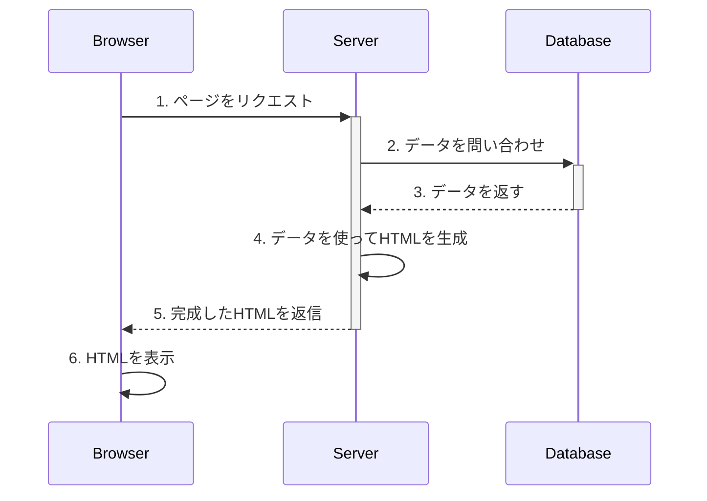
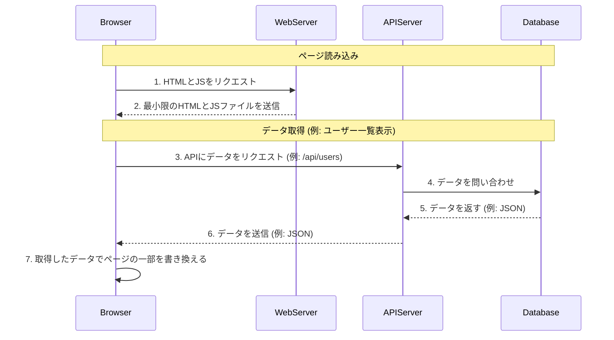

# SSRとSPA 基礎

Webアプリケーションの構築方法には、主に「サーバーサイドレンダリング（SSR）」と「シングルページアプリケーション（SPA）」という2つのアーキテクチャが存在します。この2つの違いを理解することは、モダンなWeb開発において重要です。

サーバーサイドの技術は伝統的にSSRで利用されることが多いですが、APIサーバーとしてSPAのバックエンドを担うことも可能です。ここでは、それぞれの仕組みとメリット・デメリットを解説します。

## **1. サーバーサイドレンダリング（SSR）**

SSRは、WebページのHTMLをサーバー側で生成し、完成したHTMLをブラウザに送信する方式です。これは、従来からの伝統的なWebアプリケーションのアプローチです。

###仕組み

1. **リクエスト**: ユーザーがリンクをクリックするなどして、ブラウザがサーバーにページを要求します。  
2. **サーバー処理**:  
   * サーバーサイドのアプリケーションがリクエストを受け取ります。  
   * データベースから必要な情報を取得します。  
   * 取得したデータをHTMLテンプレートに流し込みます。  
   * **サーバー側で完全なHTMLを生成します。**  
3. **レスポンス**: 完成したHTMLファイルが、ブラウザに送信されます。  
4. **表示**: ブラウザは受け取ったHTMLをそのまま表示します。

ユーザーがサイト内の別のページに移動するたびに、この1〜4のプロセスが繰り返されます。

### **サーバーサイドでの例**

サーバーサイドのテンプレートエンジン（例: PHPのBlade/Twig, Ruby on RailsのERB, JavaのThymeleaf, Node.jsのEJSなど）を利用し、HTML内にプログラムの変数を埋め込んで動的なページを生成する手法がSSRにあたります。

### **メリット**

* **SEO（検索エンジン最適化）に強い**: ページのHTMLに初めから全てのコンテンツが記述されているため、検索エンジンのクローラーが内容を正確に認識しやすいです。  
* **古いブラウザや非力なデバイスでも動作しやすい**: 複雑な処理をサーバー側で行うため、ユーザーのデバイス（ブラウザ）に負荷がかかりにくいです。

### **デメリット**

* **画面遷移のたびにページ全体を再読み込みする**: 別のページに移動するたびにサーバーとの通信が発生し、ページ全体がリフレッシュされるため、アプリケーションのような応答性は得られにくいです。  
* **サーバーへの負荷が大きい**: ユーザーのリクエストごとにHTML生成処理が走るため、アクセスが増えるとサーバーの負荷が高くなりがちです。

## **2. シングルページアプリケーション（SPA）**

SPAは、最初に一つのHTMLファイル+JavaScriptのみを読み込み、その後はJavaScriptがサーバーと非同期通信（API通信）を行い、取得したデータをもとにページの内容を動的に書き換えていく方式です。

### **仕組み**

1. **初回リクエスト**: ユーザーが最初にサイトにアクセスしたときだけ、サーバーは最小限のHTMLファイルと、アプリケーションの大部分を構成するJavaScriptファイルをブラウザに送ります。  
2. **初期表示**: ブラウザは受け取ったJavaScriptを実行します。JavaScriptはAPIサーバー（バックエンド）に必要なデータを要求します。  
3. **動的描画**: JavaScriptは、APIサーバーから受け取ったデータ（通常はJSON形式）をもとに、ブラウザ上で動的にHTMLを組み立ててページを表示します。  
4. **画面遷移**: ユーザーがサイト内の別のリンクをクリックすると、ページ全体を再読み込みする代わりに、  
   * JavaScriptがその動作を検知します。  
   * APIサーバーに次のページに必要なデータだけをリクエストします。  
   * 受け取ったデータをもとに、**ページの必要な部分だけを書き換えます。**

### **サーバーサイドの役割**

SPA構成の場合、サーバーサイドのアプリケーションはHTMLを生成しません。代わりに、JavaScriptからのリクエストに応じてデータベースとやり取りし、**データをJSON形式で返す「APIサーバー」としての役割**に徹します。

### **メリット**

* **リッチで高速なユーザー体験**: 画面遷移時にページの再読み込みが発生しないため、デスクトップアプリケーションのようにスムーズで素早い操作感を実現できます。  
* **サーバー負荷の軽減**: サーバーは純粋なデータ（JSON）を返すだけでよくなり、HTML生成の負荷がなくなります。  
* **フロントエンドとバックエンドの分離**: 画面表示（フロントエンド：JavaScript）とデータ処理（バックエンド）の役割が明確に分かれます。これにより、チームでの分業がしやすくなったり、同じAPIをWebアプリケーションとネイティブアプリケーションで共用したりすることが可能になります。

### **デメリット**

* **SEO対策が難しい**: 初回に読み込むHTMLがコンテンツを含まない場合があるため、検索エンジンのクローラーが内容を認識できないことがあります。（ただし、近年はこの問題を解決する技術も進化しています。）  
* **必要な技術要素が多い**: JavaScript（React, Vue, Angularなど）の知識が必須になり、状態管理などフロントエンド側で考慮すべき点が増えます。

## **まとめ：SSR vs SPA 比較表**

| 項目 | SSR (サーバーサイドレンダリング) | SPA (シングルページアプリケーション) |
| :---- | :---- | :---- |
| **初期表示速度** | 速い | 遅くなることがある |
| **画面遷移の速度** | 遅い（ページ全体を再読み込み） | 速い（必要な部分だけ更新） |
| **ユーザー体験** | 伝統的なWebサイト | アプリケーションライクで滑らか |
| **SEO** | 有利 | 工夫が必要 |
| **サーバー負荷** | 高い（HTML生成） | 低い（データ返却のみ） |
| **開発** | サーバーサイド中心で比較的シンプル | バックエンド(API) + フロントエンド(UI) で複雑になりがち |
| **サーバーサイドの役割** | HTMLの生成とデータ処理 | APIとしてデータ処理に専念 |

## **アーキテクチャの選択**

どちらのアーキテクチャが最適かは、開発するアプリケーションの要件によって決まります。

* **SSRが適したケース**: ブログ、ニュースサイト、ECサイトなど、コンテンツが主体でSEOが重要な場合に有効な選択肢です。  
* **SPAが適したケース**: ダッシュボード、管理画面、SNSなど、ユーザーの操作が多く、リッチなUI/UXが求められるアプリケーションに向いています。

まず何らかのサーバーサイド技術を用いた伝統的なSSRでの開発を習得することで、Webの基本的な仕組みへの理解が深まります。その上で、次のステップとしてAPIを構築し、JavaScriptフレームワークと連携するSPA開発へ進むのが一般的な学習パスです。

両方のアーキテクチャを理解することで、より幅広い要件に対応できる開発が可能になります。
