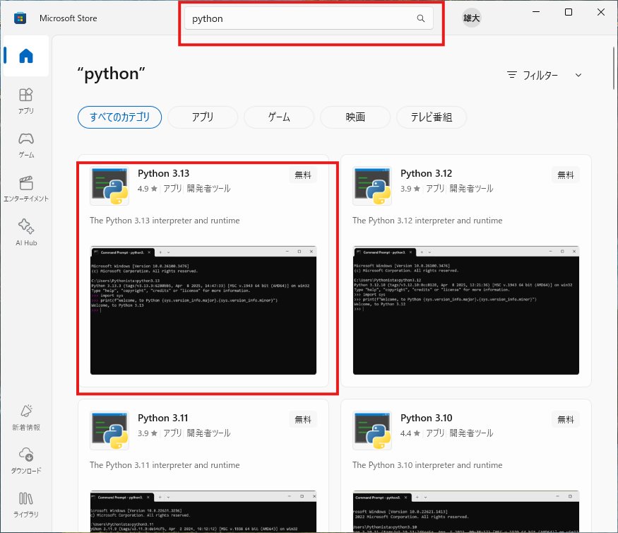
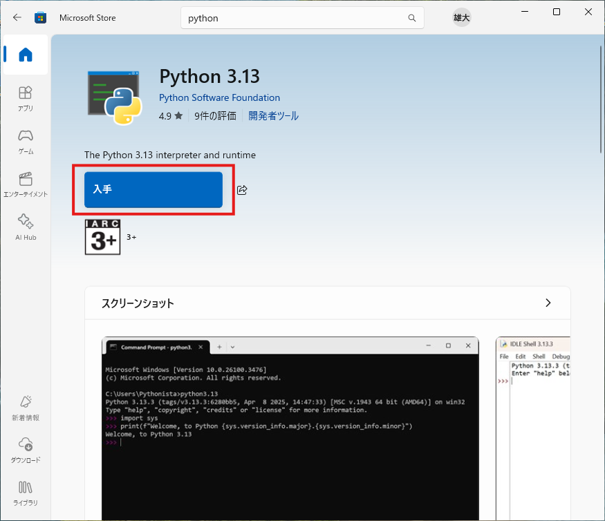
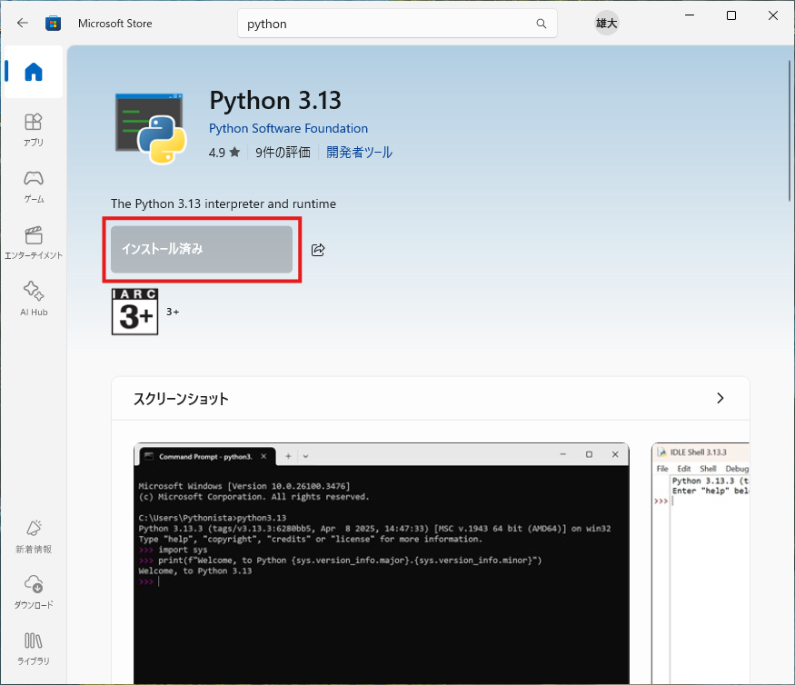
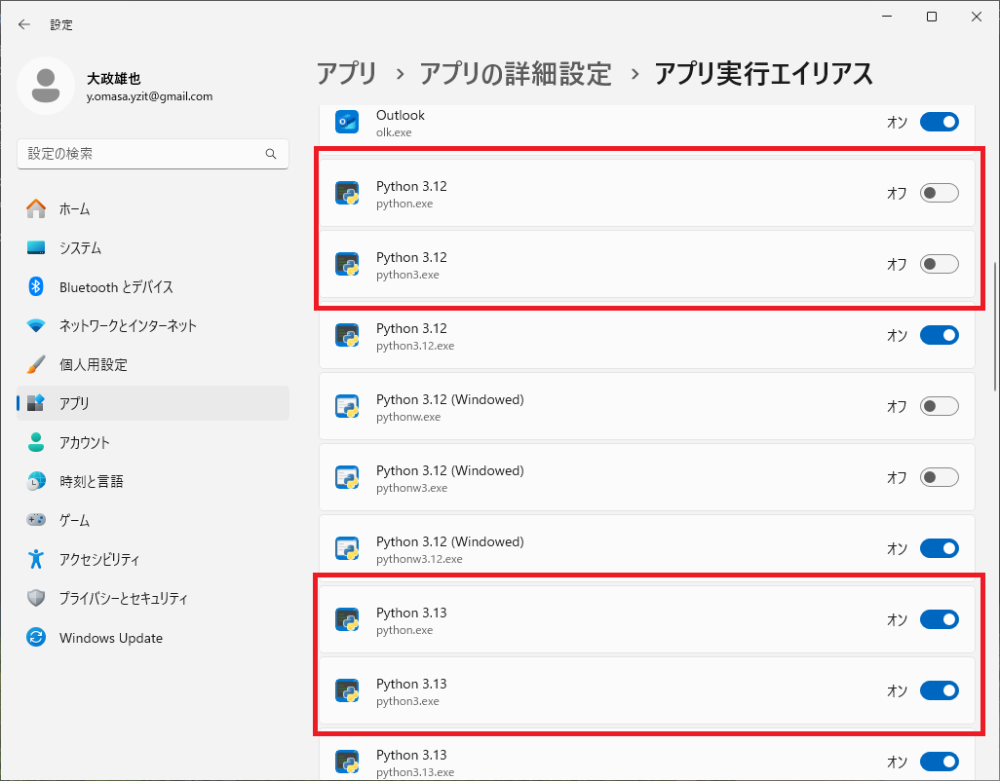

# Windows Store から Python をインストールする手順

## 1. Windows Store を開く
1. タスクバーの検索ボックスに「Microsoft Store」と入力し、アプリを開きます。

## 2. Python を検索
1. Microsoft Store の検索バーに「Python」と入力します。
2. 検索結果から「Python 3.x」（バージョン番号は最新のもの）を選択します。


## 3. Python のインストール
1. 「入手」または「インストール」ボタンをクリックします。
   

2. ダウンロードとインストールが自動的に開始されます。
       完了したら、画面上にその旨が表示されます。
    

## 4. インストールの確認
   
1. コマンドプロンプトを開き、以下のコマンドでPythonのバージョンを確認します。

    ```
    python --version
    ```
    正しくインストールされていれば、Python のバージョンが表示されます。
  
2. コマンドプロンプトで以下のコマンドを実行し、pipのバージョンを確認します。

    ```
    pip --version
    ```
    正しくインストールされていれば、pipのバージョンが表示されます。


## 5. 複数バージョンのPythonのインストールと切り替え

### 複数バージョンのインストール
Microsoft Store では、異なるバージョンの Python（例: Python 3.12, Python 3.13 など）を同時にインストールできます。各バージョンは個別のアプリとして管理されます。

1. 前出の手順でMicrosoft Store からインストールしたいバージョンをそれぞれインストールします。

### アプリ実行エイリアスによるバージョン切り替え

Windows では「アプリ実行エイリアス」を利用して、コマンドラインで呼び出す Python のバージョンを切り替えることができます。

2. **設定アプリを開く**  
    「設定」→「アプリ」→「アプリの詳細設定」→「アプリ実行エイリアス」を選択します。

3. **Python のエイリアスを切り替える**  
    インストールされている各 Python バージョンの「python.exe」「python3.exe」などのエイリアスが表示されます。  
    使用したいバージョンのエイリアスを「オン」にし、他のバージョンは「オフ」にします。
    例えば3.13と3.12がインストールされている環境で3.12を有効にしたい場合、 **Python3.13のpython.exeとpython3.exeをオフ** にし、**Python3.12のpython.exeとpython3.exeをオン** にします
    


4. **コマンドプロンプトで確認**  
    エイリアスを切り替えた後、Windowsを再起動してください。その後、コマンドプロンプトを起動し、 `python --version` を実行する。切り替わったバージョンが標示されることを確認します。

> **注意:**  
> 1. エイリアスの設定を変更した後は、コマンドプロンプトを再起動してください。それでも反映されなければWindowsを再起動して下さい。
> 2. 再起動しても変更が反映されない場合があります。その場合は仕方がないので、使用するバージョン以外のPythonをUninstallして、インストール済みのPythonバージョンが一つになるようにしてください。